# BP.ML activity diagrams

These diagrams describe every semantic code label in the combined annotated [BP.ML.s](../../combined/asm/BP.ML.s). Public jump-table vectors, internal helpers, and named fall-through phases are included. ROM and KERNAL equates, autogenerated address labels such as `LCA6F`, and embedded data labels beginning at `DimExpressions` are excluded.

The diagrams are reconstructed from the disassembly and article-facing ABI. They show semantic activities rather than every 6502 instruction. Array index zero is included where the code uses BASIC's allocated zero row or column.

## Data structures and model

The engine uses two distinct storage layers: the neural-network model is held in BASIC scalars and five-byte floating arrays, while fixed C64 RAM cells hold the machine-language address map and runtime state. The complete cross-engine reference is [BP.ML and CL.ML data structures](../ML-DATA-STRUCTURES.md). Source authority for BP.ML is the [workspace equate map](../../combined/asm/BP.ML.s#L23), [DIM expression](../../combined/asm/BP.ML.s#L1893), and [snapshot write order](../../combined/asm/BP.ML.s#L1539).

### BASIC-resident network model

DIM bounds are inclusive, so `O2(P2)` contains indices `0..P2` and `IN(P1,NP)` contains `(P1+1)*(NP+1)` elements. Active neurons and stored patterns begin at one. Index zero has defined purposes:

- `IN(0,pattern)=1` supplies the input-layer bias, including scratch pattern zero.
- `O2(0)=1` supplies the output layer's bias input.
- `O3(0)=1` initializes the output array's index-zero slot, but no later layer consumes it.
- Pattern zero is the recognition scratch column.
- Weight and momentum arrays include zero-index storage because BASIC allocates every inclusive dimension.

`IndexVector` advances five bytes per index. `IndexMatrix` calculates `5*(secondIndex*(firstBound+1)+firstIndex)`, so the first declared subscript changes fastest.

| Structure | Logical shape | Purpose | Saved |
| --- | --- | --- | --- |
| `P1`, `P2`, `P3`, `NP` | Four BASIC scalars plus byte copies | Input, hidden, output, and stored-pattern counts | Yes |
| `RA`, `MO`, `EP` | BASIC scalars | Learning rate, momentum factor, and stopping tolerance | Yes |
| `TE` | BASIC scalar | Total pre-update error accumulated during an epoch | No |
| `IN(P1,NP)` | Input `0..P1` by pattern `0..NP` | Binary inputs; row zero is bias and column zero is recognition scratch | Yes |
| `T(P3,NP)` | Output `0..P3` by pattern `0..NP` | Teacher vectors for supervised training | Yes |
| `W1(P2,P1)` | Hidden `0..P2` by input `0..P1` | Input-to-hidden weights; input zero is the hidden bias weight | Yes |
| `M1(P2,P1)` | Same as `W1` | Previous `W1` changes used by momentum | Yes |
| `O2(P2)`, `E2(P2)` | Hidden `0..P2` | Hidden activations and hidden deltas | No |
| `W2(P3,P2)` | Output `0..P3` by hidden `0..P2` | Hidden-to-output weights; hidden zero is the output bias weight | Yes |
| `M2(P3,P2)` | Same as `W2` | Previous `W2` changes used by momentum | Yes |
| `O3(P3)`, `E3(P3)` | Output `0..P3` | Output activations and output deltas | No |
| `E(NP)` | Pattern `0..NP` | Half squared error for each pattern; index zero is scratch | No |

### Machine-language workspace map

After `MakeOffsetsRelative`, offsets are 16-bit little-endian displacements relative to `BASIC_VARTAB` for scalars or `BASIC_ARYTAB` for arrays. During initialization, the slots temporarily contain absolute lookup addresses. Pointers are absolute 16-bit addresses. This state is global, transient, and not serialized.

| Address | Symbol | Representation | Maps or controls |
| --- | --- | --- | --- |
| `$02A7-$02A8` | `SavedTextPtr` | Absolute pointer | Saved BASIC parser position |
| `$02A9` | `InputCount` | Unsigned byte | `P1` |
| `$02AA` | `HiddenCount` | Unsigned byte | `P2` |
| `$02AB` | `OutputCount` | Unsigned byte | `P3` |
| `$02AC` | `PatternCount` | Unsigned byte | `NP` |
| `$02AD-$02AE` | `RateOffset` | VARTAB-relative offset | `RA` |
| `$02AF-$02B0` | `EpsilonOffset` | VARTAB-relative offset | `EP` |
| `$02B1-$02B2` | `MomentumOffset` | VARTAB-relative offset | `MO` |
| `$02B3-$02B4` | `O2Offset` | ARYTAB-relative offset | `O2(0)` |
| `$02B5-$02B6` | `O3Offset` | ARYTAB-relative offset | `O3(0)` |
| `$02B7-$02B8` | `E2Offset` | ARYTAB-relative offset | `E2(0)` |
| `$02B9-$02BA` | `E3Offset` | ARYTAB-relative offset | `E3(0)` |
| `$02BB` | `PatternIndex` | Unsigned byte | Selected pattern; zero is recognition scratch |
| `$02BF-$02C0` | `W1Offset` | ARYTAB-relative offset | `W1(0,0)` |
| `$02C1-$02C2` | `W2Offset` | ARYTAB-relative offset | `W2(0,0)` |
| `$02C3-$02C4` | `M1Offset` | ARYTAB-relative offset | `M1(0,0)` |
| `$02C5-$02C6` | `M2Offset` | ARYTAB-relative offset | `M2(0,0)` |
| `$02C7-$02C8` | `TeacherOffset` | ARYTAB-relative offset | `T(0,0)` |
| `$02C9-$02CA` | `InputOffset` | ARYTAB-relative offset | `IN(0,0)` |
| `$02CB-$02CC` | `ErrorOffset` | ARYTAB-relative offset | `E(0)` |
| `$02CD-$02D1` | `WorkFloat` | Five-byte float with two-byte overlay | Accumulation scratch; first two bytes can hold a temporary pointer |
| `$02D2-$02D3` | `TotalErrorOffset` | VARTAB-relative offset | `TE` |
| `$02D4-$02D5` | `TotalErrorPtr` | Absolute pointer | Resolved `TE` |
| `$02D6-$02D7` | `EpsilonPtr` | Absolute pointer | Resolved `EP` |
| `$02D8-$02DC` | `ErrorScratch` | Five-byte float | Teacher minus output before squaring |
| `$02DD-$02F2` | `FilenameBuffer` | 22 bytes | Up to 20 filename bytes plus `,R` or `,W` |
| `$0334-$0335` | `ElementPtr` | Absolute pointer | Selected five-byte array element |
| `$0336` | `IndexI` | Unsigned byte | Outer loop index |
| `$0338` | `IndexJ` | Unsigned byte | Inner loop index |
| `$03FC` | `ShowError` | Boolean byte | Controls epoch error printing |
| `$03FD` | `MatrixBound` | Unsigned byte | First matrix dimension upper bound |

`$02BC-$02BE`, `$0337`, and `$0339` are gaps, not named BP.ML fields. The embedded DIM text, lookup strings, and floating constants are mapped in the [complete BP.ML reference](../ML-DATA-STRUCTURES.md#bpml-embedded-read-only-data).

### Serialized model structure

The save stream is `P1, P2, P3, NP, RA, MO, EP, W1, W2, M1, M2, IN, T`. It has no header, version, stored length, or checksum. Total size is `19 + 10*(P2+1)*(P1+1) + 10*(P3+1)*(P2+1) + 5*(P1+1)*(NP+1) + 5*(P3+1)*(NP+1)` bytes. The [complete layout](../ML-DATA-STRUCTURES.md#bpml-serialized-network-layout) identifies each relative field.

### Data model

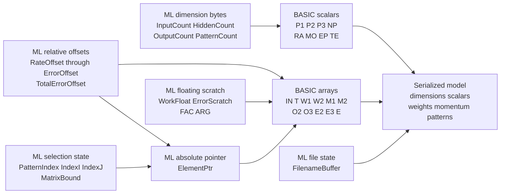

Activity nodes identify data access directly. `Reads` names the exact structures inspected without modification, `Writes` names the exact structures created or changed, and `Data access: none` marks control-only entry, exit, and transfer nodes.

## Public entry vectors

The published BASIC callers are the behavioral source for this section. [XOR.bas](../../combined/basic/XOR.bas) and [ENCODE.bas](../../combined/basic/ENCODE.bas) establish the inputs, repeated calls, and result handling. Each diagram expands the selected machine-language entry into its performed activities.

### `BP_Init`

Sources: [BP.ML.s lines 109-615](../../combined/asm/BP.ML.s#L109), [XOR.bas line 50](../../combined/basic/XOR.bas#L13), [ENCODE.bas line 50](../../combined/basic/ENCODE.bas#L13)

**Work performed:** Initializes the backpropagation network by parsing its topology and learning parameters, creating BASIC storage, setting bias elements, randomizing both weight matrices, and caching relative data addresses.

| Inputs / preconditions | Outputs / side effects |
| --- | --- |
| BASIC arguments `p1`, `p2`, `p3`, `np`, `rate`, `momentum`, and `epsilon`; BASIC storage; RND state | Dimension state and BASIC scalars/arrays created; biases set; W1 and W2 randomized; relative offsets cached |

**Data structures used:** BASIC caller constants and argument stream; BASIC RND state; P1, P2, P3, NP; RA, MO, EP, TE; O2, O3, E2, E3, W1, W2, M1, M2, T, IN, E; cached offsets

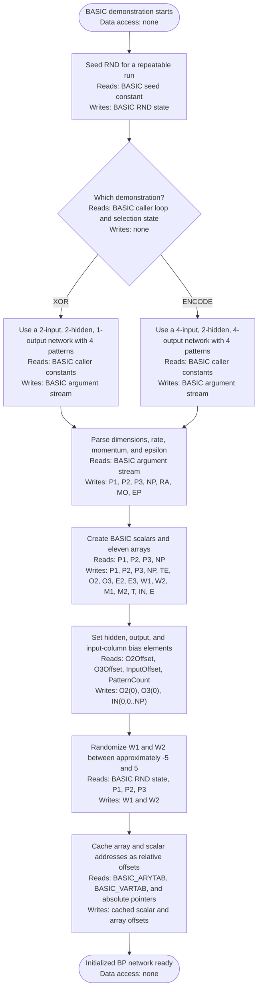

### `BP_Recognize`

Sources: [BP.ML.s lines 114-919](../../combined/asm/BP.ML.s#L114), [XOR.bas lines 170-280](../../combined/basic/XOR.bas#L28), [ENCODE.bas lines 180-410](../../combined/basic/ENCODE.bas#L29)

**Work performed:** Converts an input bit string into scratch input storage, propagates it through the hidden and output sigmoid layers, computes scratch error, and leaves the calculated activations in O2 and O3.

| Inputs / preconditions | Outputs / side effects |
| --- | --- |
| Initialized network and an input bit string of length P1 | Scratch column `IN(:,0)` populated; `O2`, `O3`, and scratch error `E(0)` calculated |

**Data structures used:** BASIC input string and caller loop state; P1; PatternIndex; IN(:,0); W1; O2; W2; O3; T(:,0); E(0)

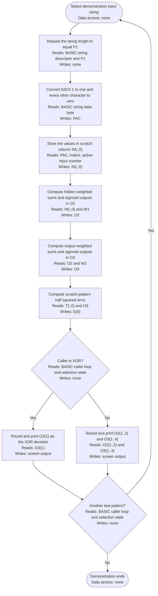

### `BP_TrainPattern`

Source: [BP.ML.s lines 119-1298](../../combined/asm/BP.ML.s#L119)

**Work performed:** Trains one selected stored pair by performing a forward pass, calculating output and hidden deltas, and applying learning-rate and momentum updates to both weight matrices.

| Inputs / preconditions | Outputs / side effects |
| --- | --- |
| Stored-pattern number from BASIC; initialized network and training pair | `PatternIndex`, activations, errors, deltas, momentum arrays, and W1/W2 updated for one pair |

**Data structures used:** BASIC argument stream; PatternCount; PatternIndex; IN; T; W1; W2; O2; O3; E; E2; E3; M1; M2; RA; MO

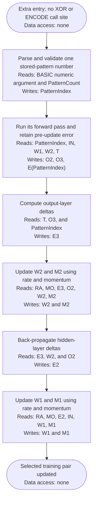

### `BP_TrainEpoch`

Source: [BP.ML.s lines 124-1341](../../combined/asm/BP.ML.s#L124)

**Work performed:** Clears total error, trains every stored pair once, and accumulates each pair's pre-update error in TE.

| Inputs / preconditions | Outputs / side effects |
| --- | --- |
| Initialized network; stored pairs `IN` and `T`; current weights and momentum | Every pair trained once; W1/W2 and M1/M2 updated; total pre-update error stored in `TE` |

**Data structures used:** PatternCount; PatternIndex; IN; T; W1; W2; O2; O3; E; E2; E3; M1; M2; RA; MO; TE

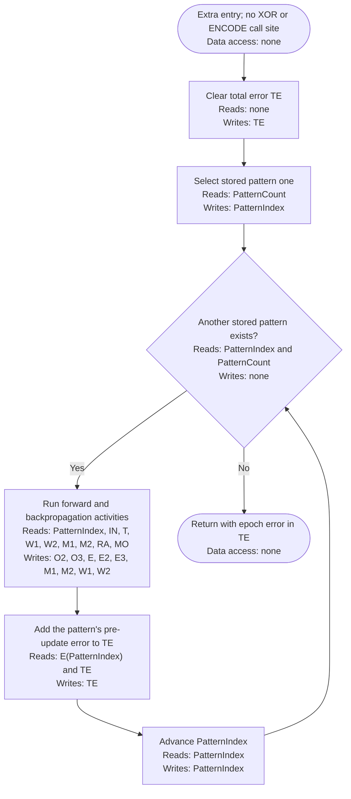

### `BP_Learn`

Sources: [BP.ML.s lines 129-1383](../../combined/asm/BP.ML.s#L129), [XOR.bas line 140](../../combined/basic/XOR.bas#L24), [ENCODE.bas line 140](../../combined/basic/ENCODE.bas#L24)

**Work performed:** Repeats complete training epochs, optionally prints total error, honors RUN/STOP, and stops when total error is no greater than epsilon.

| Inputs / preconditions | Outputs / side effects |
| --- | --- |
| BASIC `show_error` flag; initialized network; `EP` tolerance and stored pairs | Repeated epoch updates until `TE <= EP` or RUN/STOP; optional TE output |

**Data structures used:** BASIC show-error argument; ShowError; PatternCount; PatternIndex; training arrays; RA; MO; EP; TE; KERNAL RUN/STOP state; screen output

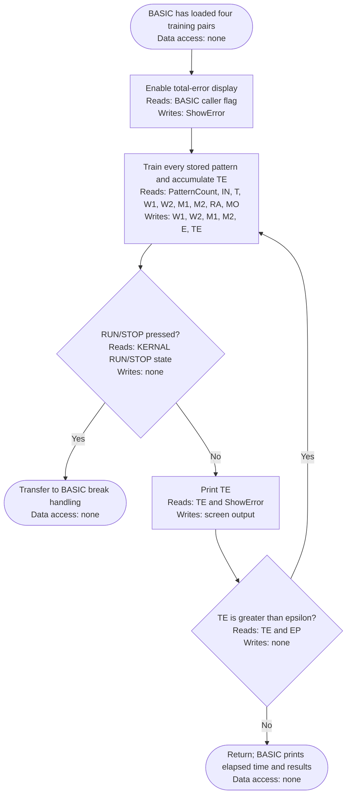

### `BP_DefinePair`

Sources: [BP.ML.s lines 134-1497](../../combined/asm/BP.ML.s#L134), [XOR.bas lines 60-90](../../combined/basic/XOR.bas#L15), [ENCODE.bas lines 60-90](../../combined/basic/ENCODE.bas#L15)

**Work performed:** Validates a training-pair index and converts the supplied input and teacher bit strings into the IN and T matrices.

| Inputs / preconditions | Outputs / side effects |
| --- | --- |
| BASIC pair number, input bit string, and teacher bit string | Selected columns of `IN` and `T` populated, or BASIC error raised for invalid input |

**Data structures used:** BASIC caller pattern strings and loop state; P1; P3; NP; PatternIndex; IN; T

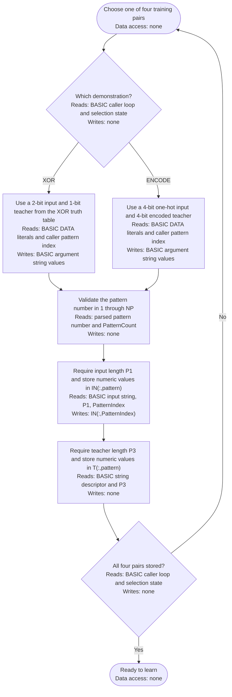

### `BP_Save`

Source: [BP.ML.s lines 139-1671](../../combined/asm/BP.ML.s#L139)

**Work performed:** Opens a sequential device-8 file and serializes network dimensions, learning parameters, weights, momentum arrays, inputs, and teacher outputs.

| Inputs / preconditions | Outputs / side effects |
| --- | --- |
| BASIC filename; initialized dimensions, parameters, arrays, and device 8 | Sequential snapshot file written; data and status channels closed |

**Data structures used:** BASIC filename; FilenameBuffer; KERNAL channel state; drive status stream; P1, P2, P3, NP; RA, MO, EP; W1, W2, M1, M2, IN, T; snapshot stream

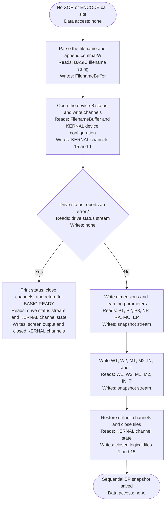

### `BP_Load`

Source: [BP.ML.s lines 144-1892](../../combined/asm/BP.ML.s#L144)

**Work performed:** Opens a saved network snapshot, restores its dimensions, recreates the required BASIC storage, and reloads parameters and matrices.

| Inputs / preconditions | Outputs / side effects |
| --- | --- |
| BASIC filename and readable device-8 snapshot | BASIC storage recreated; dimensions, parameters, weights, momentum, inputs, and teachers restored |

**Data structures used:** BASIC filename; FilenameBuffer; KERNAL channel state; drive status and snapshot streams; BASIC memory boundaries; P1, P2, P3, NP; RA, MO, EP; W1, W2, M1, M2, IN, T; cached offsets

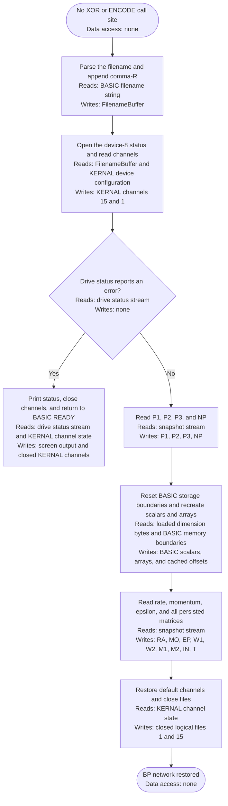

## Initialization and storage

### `InitializeNetwork`

Source: [BP.ML.s lines 149-226](../../combined/asm/BP.ML.s#L149)

**Work performed:** Parses four byte-sized network dimensions and stores the learning rate, momentum, and error tolerance through BASIC scalar lookup.

| Inputs / preconditions | Outputs / side effects |
| --- | --- |
| BASIC parser at `p1,p2,p3,np,rate,momentum,epsilon`; BASIC memory; RND state | Counts and learning scalars stored; arrays created; biases and random weights initialized; offsets made relative |

**Data structures used:** BASIC argument stream; SavedTextPtr; P1, P2, P3, NP; RA, MO, EP offsets and scalars

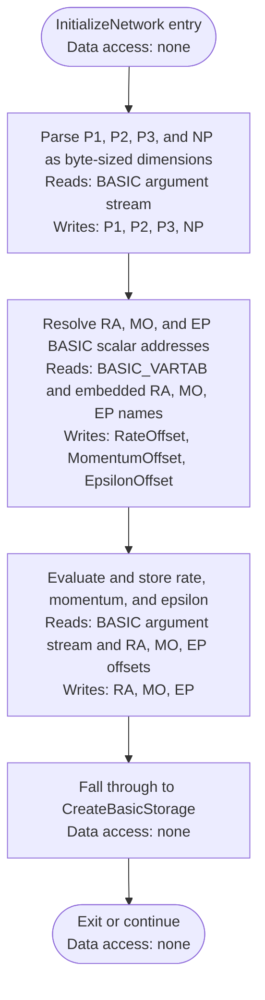

### `CreateBasicStorage`

Source: [BP.ML.s lines 227-308](../../combined/asm/BP.ML.s#L227)

**Work performed:** Creates the network's BASIC scalars and dimensions eleven arrays for inputs, activations, errors, weights, momentum, and teachers.

| Inputs / preconditions | Outputs / side effects |
| --- | --- |
| `InputCount`, `HiddenCount`, `OutputCount`, and `PatternCount`; available BASIC variable/array memory | RA/MO/EP/TE scalars and eleven network arrays created and located |

**Data structures used:** P1, P2, P3, NP; TE; BASIC_VARTAB; BASIC_ARYTAB; O2, O3, E2, E3, W1, W2, M1, M2, T, IN, E

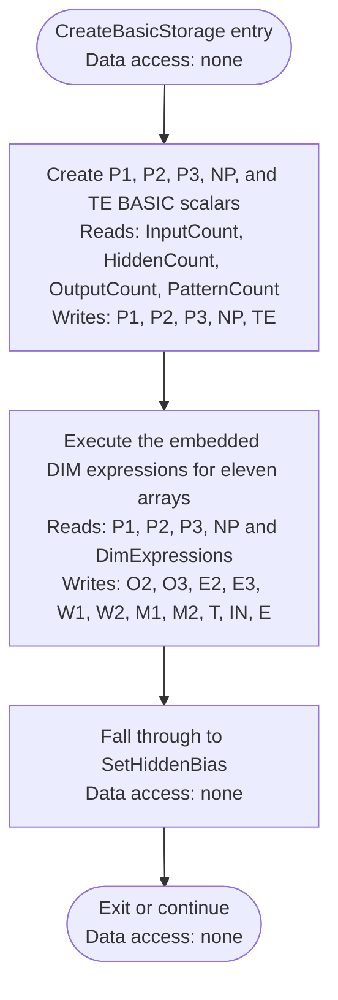

### `SetHiddenBias`

Source: [BP.ML.s lines 309-338](../../combined/asm/BP.ML.s#L309)

**Work performed:** Sets O2(0) and O3(0) to one so later matrix multiplication includes hidden-layer and output-layer bias terms.

| Inputs / preconditions | Outputs / side effects |
| --- | --- |
| Allocated `O2` and `O3` arrays and their cached addresses | `O2(0)=1` and `O3(0)=1` |

**Data structures used:** O2Offset; O3Offset; O2(0); O3(0); FAC

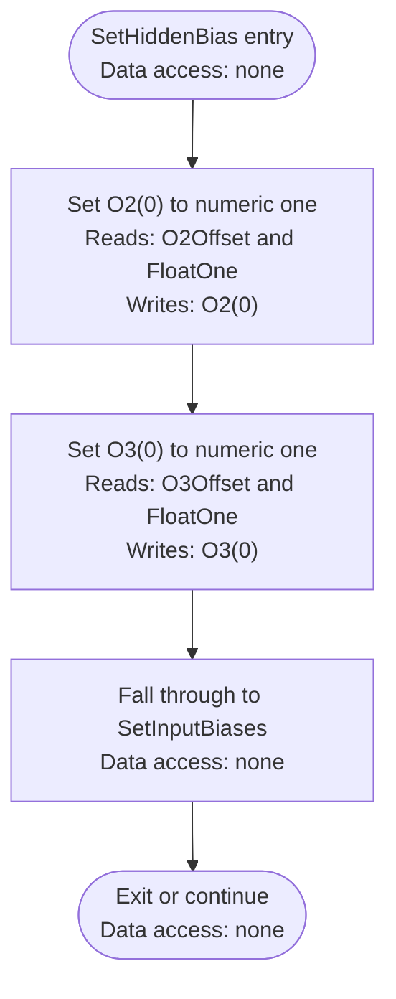

### `SetInputBiases`

Source: [BP.ML.s lines 339-364](../../combined/asm/BP.ML.s#L339)

**Work performed:** Writes a constant one to input index zero for every stored pattern and scratch pattern zero.

| Inputs / preconditions | Outputs / side effects |
| --- | --- |
| Allocated `IN`; `PatternCount`; cached input-array address | `IN(0,pattern)=1` for scratch pattern zero and every stored pattern |

**Data structures used:** InputOffset; PatternCount; IndexI; IN(0,0..NP); FAC

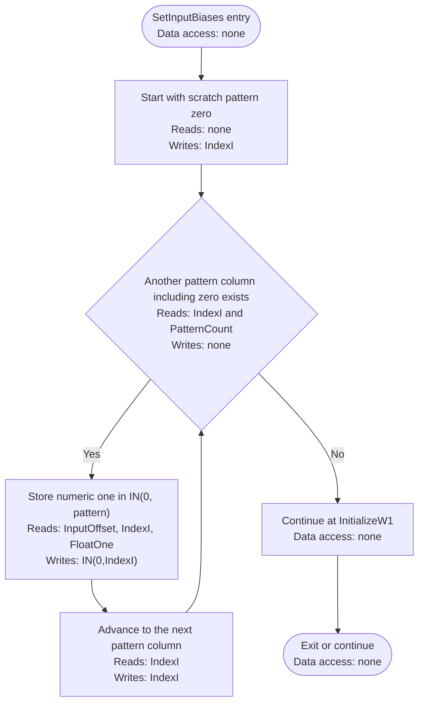

### `InitializeW1`

Source: [BP.ML.s lines 365-378](../../combined/asm/BP.ML.s#L365)

**Work performed:** Walks every allocated W1 element, including index-zero slots, and assigns a random starting weight.

| Inputs / preconditions | Outputs / side effects |
| --- | --- |
| Allocated W1 dimensions; input and hidden counts; RND state | Every allocated W1 element initialized to a random value |

**Data structures used:** W1Offset; InputCount; HiddenCount; IndexI; IndexJ; ElementPtr; W1

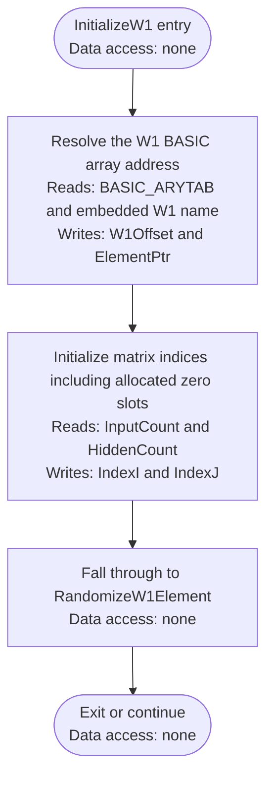

### `RandomizeW1Element`

Source: [BP.ML.s lines 379-411](../../combined/asm/BP.ML.s#L379)

**Work performed:** Generates one W1 value with BASIC floating-point arithmetic using the formula 10 times RND(1) minus 5.

| Inputs / preconditions | Outputs / side effects |
| --- | --- |
| `ElementPtr` identifying one W1 element; BASIC RND state | Selected W1 element receives `10*RND(1)-5`; floating-point scratch is updated |

**Data structures used:** W1; W1Offset; IndexI; IndexJ; ElementPtr; FAC; BASIC RND state; InputCount; HiddenCount

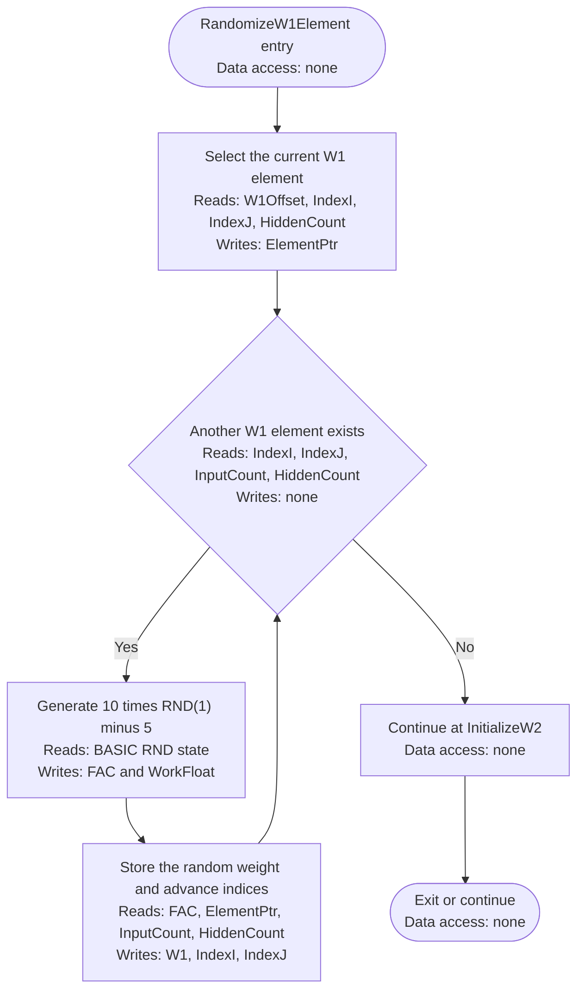

### `InitializeW2`

Source: [BP.ML.s lines 412-457](../../combined/asm/BP.ML.s#L412)

**Work performed:** Walks every allocated W2 element and initializes it with the same approximately -5 to 5 random distribution.

| Inputs / preconditions | Outputs / side effects |
| --- | --- |
| Allocated W2 dimensions; hidden and output counts; RND state | Every allocated W2 element initialized to a random value |

**Data structures used:** W2; W2Offset; IndexI; IndexJ; ElementPtr; FAC; BASIC RND state; HiddenCount; OutputCount

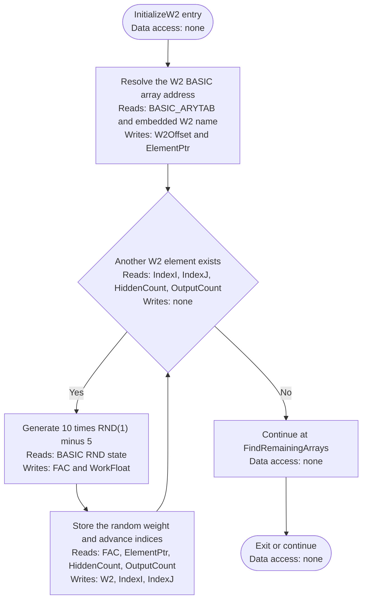

### `FindRemainingArrays`

Source: [BP.ML.s lines 458-501](../../combined/asm/BP.ML.s#L458)

**Work performed:** Locates and caches the BASIC array addresses for error, teacher, and momentum data after allocation.

| Inputs / preconditions | Outputs / side effects |
| --- | --- |
| BASIC arrays created by `CreateBasicStorage`; BASIC array table | Absolute addresses for E, T, M1, and M2 cached before offset conversion |

**Data structures used:** BASIC_ARYTAB; E, T, M1, M2 absolute pointers; ErrorOffset; TeacherOffset; M1Offset; M2Offset

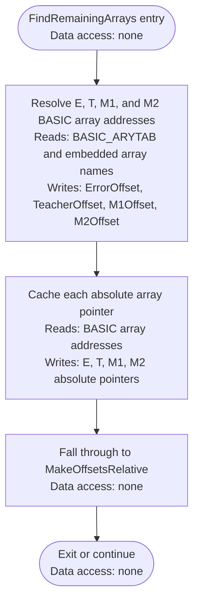

### `MakeOffsetsRelative`

Source: [BP.ML.s lines 502-615](../../combined/asm/BP.ML.s#L502)

**Work performed:** Converts cached array and scalar pointers into offsets relative to BASIC's ARYTAB and VARTAB bases so later lookups survive relocation.

| Inputs / preconditions | Outputs / side effects |
| --- | --- |
| Cached absolute scalar/array pointers; `BASIC_VARTAB` and `BASIC_ARYTAB` | All cached pointers converted to relocatable scalar or array offsets |

**Data structures used:** BASIC_ARYTAB; BASIC_VARTAB; O2Offset, O3Offset, E2Offset, E3Offset, W1Offset, W2Offset, M1Offset, M2Offset, TeacherOffset, InputOffset, ErrorOffset; RA, MO, EP, TE offsets

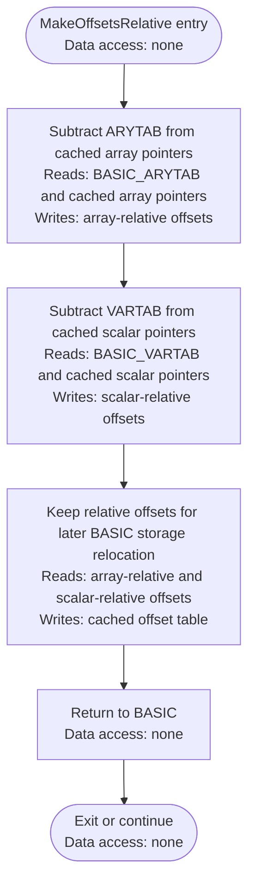

## Recognition and math helpers

### `RecognizeString`

Source: [BP.ML.s lines 616-621](../../combined/asm/BP.ML.s#L616)

**Work performed:** Imports the supplied recognition string into scratch input column zero and starts a forward pass for that scratch pattern.

| Inputs / preconditions | Outputs / side effects |
| --- | --- |
| BASIC input string; initialized network | `PatternIndex=0`; scratch input column filled; forward-pass activations and `E(0)` produced |

**Data structures used:** BASIC input string; PatternIndex; IN(:,0); W1; W2; O2; O3; T(:,0); E(0)

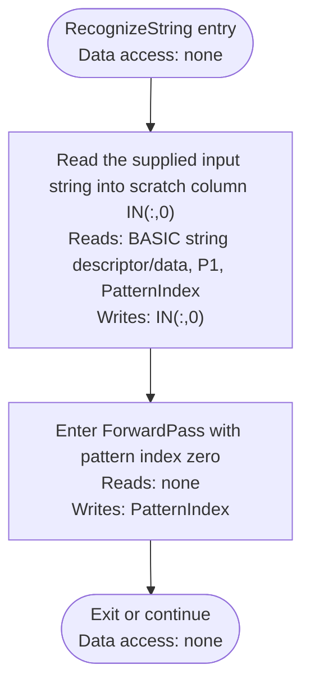

### `SelectStoredPattern`

Source: [BP.ML.s lines 622-635](../../combined/asm/BP.ML.s#L622)

**Work performed:** Parses a stored-pattern number and rejects values outside the valid range from 1 through NP.

| Inputs / preconditions | Outputs / side effects |
| --- | --- |
| Numeric BASIC argument and `PatternCount` | Validated value stored in `PatternIndex`, or BASIC illegal-quantity error raised |

**Data structures used:** BASIC numeric argument; PatternCount; PatternIndex

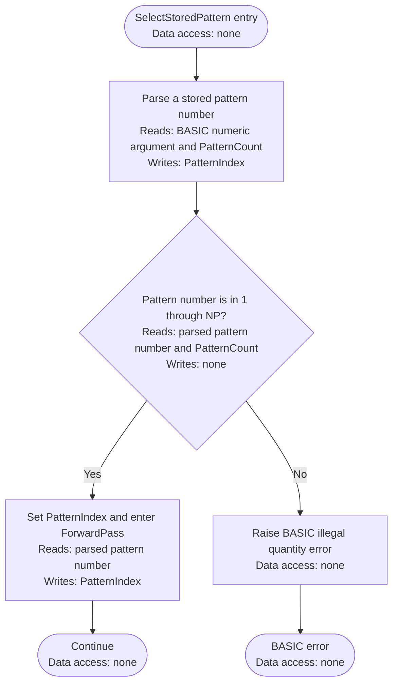

### `ForwardPass`

Source: [BP.ML.s lines 636-639](../../combined/asm/BP.ML.s#L636)

**Work performed:** Runs the hidden layer, output layer, and squared-error calculation for the currently selected pattern.

| Inputs / preconditions | Outputs / side effects |
| --- | --- |
| `PatternIndex`; IN, W1, W2, T; network dimensions | Hidden activations in O2, output activations in O3, and `E(pattern)` |

**Data structures used:** PatternIndex; IN; W1; O2; W2; O3; T; E

```mermaid
flowchart TD
    A(["ForwardPass entry<br/>Data access: none"]) --> B["Initialize hidden-neuron iteration<br/>Reads: none<br/>Writes: IndexI"]
    B --> C["Fall through to HiddenNeuron<br/>Data access: none"]
    C --> Z(["Exit or continue<br/>Data access: none"])
```

### `HiddenNeuron`

Source: [BP.ML.s lines 640-683](../../combined/asm/BP.ML.s#L640)

**Work performed:** Calculates each hidden neuron's weighted input sum from W1 and IN, including the bias element.

| Inputs / preconditions | Outputs / side effects |
| --- | --- |
| Current hidden index `IndexI`; `PatternIndex`; W1 and IN | Weighted input sum accumulated and sigmoid result stored in `O2(IndexI)`; hidden-layer iteration advances |

**Data structures used:** PatternIndex; IndexI; IndexJ; InputCount; W1; IN; WorkFloat; FAC

```mermaid
flowchart TD
    A(["HiddenNeuron entry<br/>Data access: none"]) --> B["Clear the hidden-neuron accumulator<br/>Reads: none<br/>Writes: FAC and WorkFloat"]
    B --> C{"Another input including bias index zero exists<br/>Reads: IndexJ and InputCount<br/>Writes: none"}
    C -- Yes --> D["Load W1(hidden,input) and IN(input,pattern)<br/>Reads: W1(IndexI,IndexJ) and IN(IndexJ,PatternIndex)<br/>Writes: FAC"]
    D --> E["Accumulate their product<br/>Reads: FAC and WorkFloat<br/>Writes: FAC"]
    E --> C
    C -- No --> F["Continue at HiddenSigmoid<br/>Data access: none"]
    F --> Z(["Exit or continue<br/>Data access: none"])
```

### `HiddenSigmoid`

Source: [BP.ML.s lines 684-715](../../combined/asm/BP.ML.s#L684)

**Work performed:** Applies the sigmoid function 1 divided by 1 plus EXP of the negated weighted sum to produce each hidden activation.

| Inputs / preconditions | Outputs / side effects |
| --- | --- |
| Weighted sum in FAC; current hidden index and O2 address | Sigmoid activation stored in `O2(IndexI)`; control advances to the next hidden neuron or output layer |

**Data structures used:** FAC; IndexI; HiddenCount; O2

```mermaid
flowchart TD
    A(["HiddenSigmoid entry<br/>Data access: none"]) --> B["Compute one divided by one plus exp of negative sum<br/>Reads: FAC<br/>Writes: FAC"]
    B --> C["Store O2(hidden)<br/>Reads: FAC and IndexI<br/>Writes: O2(IndexI)"]
    C --> D["Process another hidden neuron or continue to OutputLayer<br/>Data access: none"]
    D --> Z(["Exit or continue<br/>Data access: none"])
```

### `OutputLayer`

Source: [BP.ML.s lines 716-790](../../combined/asm/BP.ML.s#L716)

**Work performed:** Calculates every output neuron's weighted sum from W2 and O2, includes bias, and applies the sigmoid function.

| Inputs / preconditions | Outputs / side effects |
| --- | --- |
| `PatternIndex`; O2, W2, and output count | All O3 sigmoid activations calculated; control continues to pattern-error calculation |

**Data structures used:** PatternIndex; IndexI; IndexJ; HiddenCount; OutputCount; W2; O2; O3; WorkFloat; FAC

```mermaid
flowchart TD
    A(["OutputLayer entry<br/>Data access: none"]) --> B["Start the current output-neuron weighted sum<br/>Reads: none<br/>Writes: IndexJ, FAC, WorkFloat"]
    B --> C{"Another hidden output including bias exists<br/>Reads: IndexJ and HiddenCount<br/>Writes: none"}
    C -- Yes --> D["Multiply W2(output,hidden) by O2(hidden)<br/>Reads: W2(IndexI,IndexJ) and O2(IndexJ)<br/>Writes: FAC"]
    D --> E["Accumulate the product<br/>Reads: FAC and WorkFloat<br/>Writes: FAC"]
    E --> C
    C -- No --> F["Apply sigmoid and store O3(output)<br/>Reads: FAC and IndexI<br/>Writes: O3(IndexI)"]
    F --> G["Process another output or continue to PatternSquaredError<br/>Data access: none"]
    G --> Z(["Exit or continue<br/>Data access: none"])
```

### `PatternSquaredError`

Source: [BP.ML.s lines 791-862](../../combined/asm/BP.ML.s#L791)

**Work performed:** Calculates half the sum of squared teacher-output differences and stores it as the selected pattern's error.

| Inputs / preconditions | Outputs / side effects |
| --- | --- |
| `PatternIndex`; teacher column T; current O3 activations | Half squared error stored in `E(PatternIndex)` |

**Data structures used:** PatternIndex; IndexI; OutputCount; T; O3; E; ErrorScratch; FAC

```mermaid
flowchart TD
    A(["PatternSquaredError entry<br/>Data access: none"]) --> B["Clear E(pattern)<br/>Reads: PatternIndex<br/>Writes: E(PatternIndex) and FAC"]
    B --> C{"Another output neuron exists<br/>Reads: IndexI and OutputCount<br/>Writes: none"}
    C -- Yes --> D["Compute teacher minus output<br/>Reads: T(IndexI,PatternIndex) and O3(IndexI)<br/>Writes: ErrorScratch and FAC"]
    D --> E["Square the difference and accumulate<br/>Reads: ErrorScratch, FAC, and E(PatternIndex)<br/>Writes: FAC and E(PatternIndex)"]
    E --> C
    C -- No --> F["Divide the accumulated value by two<br/>Reads: E(PatternIndex)<br/>Writes: FAC"]
    F --> G["Store E(pattern) and return<br/>Reads: FAC and PatternIndex<br/>Writes: E(PatternIndex)"]
    G --> Z(["Exit or continue<br/>Data access: none"])
```

### `IndexVector`

Source: [BP.ML.s lines 863-883](../../combined/asm/BP.ML.s#L863)

**Work performed:** Converts a one-dimensional BASIC array index into a byte address by adding five bytes per floating-point element.

| Inputs / preconditions | Outputs / side effects |
| --- | --- |
| Base address in `ElementPtr`; vector index in A | `ElementPtr` advanced by five bytes per element to the indexed BASIC float |

**Data structures used:** A register; ElementPtr

```mermaid
flowchart TD
    A(["IndexVector entry<br/>Data access: none"]) --> B["Multiply vector index A by five bytes<br/>Reads: A register<br/>Writes: A register and carry state"]
    B --> C["Add the byte displacement to ElementPtr<br/>Reads: A register and ElementPtr<br/>Writes: ElementPtr"]
    C --> D["Return with ElementPtr at the BASIC floating-point element<br/>Reads: ElementPtr<br/>Writes: none"]
    D --> Z(["Exit or continue<br/>Data access: none"])
```

### `IndexMatrix`

Source: [BP.ML.s lines 884-919](../../combined/asm/BP.ML.s#L884)

**Work performed:** Converts two BASIC array indices into a row-major byte address using five-byte floating-point elements.

| Inputs / preconditions | Outputs / side effects |
| --- | --- |
| Base address in `ElementPtr`; dimension bound in A; matrix indices in X and Y | `ElementPtr` advanced to element `X*(A+1)+Y` using five-byte BASIC floats |

**Data structures used:** A, X, and Y registers; MatrixBound; ElementPtr

```mermaid
flowchart TD
    A(["IndexMatrix entry<br/>Data access: none"]) --> B["Compute X times first-dimension span plus Y<br/>Reads: A, X, and Y registers<br/>Writes: MatrixBound and A register"]
    B --> C["Pass the linear element index to IndexVector<br/>Reads: A register and ElementPtr<br/>Writes: ElementPtr"]
    C --> D["Return with ElementPtr at the matrix element<br/>Reads: ElementPtr<br/>Writes: none"]
    D --> Z(["Exit or continue<br/>Data access: none"])
```

### `PrintFloat`

Source: [BP.ML.s lines 920-939](../../combined/asm/BP.ML.s#L920)

**Work performed:** Formats the floating-point accumulator as a BASIC string and sends it through BASIC's string-output routine.

| Inputs / preconditions | Outputs / side effects |
| --- | --- |
| Floating-point value in FAC | Value formatted in BASIC's print buffer and emitted through BASIC string output |

**Data structures used:** FAC; BASIC_PRINT_BUFFER; BASIC string output

```mermaid
flowchart TD
    A(["PrintFloat entry<br/>Data access: none"]) --> B["Format FAC into the BASIC print buffer<br/>Reads: FAC<br/>Writes: BASIC_PRINT_BUFFER"]
    B --> C["Print the resulting BASIC string<br/>Reads: BASIC_PRINT_BUFFER<br/>Writes: screen output"]
    C --> D["Return<br/>Data access: none"]
    D --> Z(["Exit or continue<br/>Data access: none"])
```

## Backpropagation training

### `TrainSelectedPattern`

Source: [BP.ML.s lines 940-945](../../combined/asm/BP.ML.s#L940)

**Work performed:** Parses one stored-pattern number, runs its forward pass, and then transfers control to the weight-adjustment routine.

| Inputs / preconditions | Outputs / side effects |
| --- | --- |
| Numeric BASIC stored-pattern argument; initialized training data | Pattern validated and selected; forward values, deltas, momentum, and weights updated |

**Data structures used:** BASIC numeric argument; PatternCount; PatternIndex; forward-pass and training arrays

```mermaid
flowchart TD
    A(["TrainSelectedPattern entry<br/>Data access: none"]) --> B["Parse and validate a stored pattern through SelectStoredPattern<br/>Reads: BASIC numeric argument and PatternCount<br/>Writes: PatternIndex"]
    B --> C["Complete its ForwardPass<br/>Reads: PatternIndex, IN, W1, W2, T<br/>Writes: O2, O3, E(PatternIndex)"]
    C --> D["Enter OutputDeltaLoop<br/>Data access: none"]
    D --> Z(["Exit or continue<br/>Data access: none"])
```

### `TrainCurrentPattern`

Source: [BP.ML.s lines 946-948](../../combined/asm/BP.ML.s#L946)

**Work performed:** Trains the pattern already held in PatternIndex without reparsing a BASIC argument.

| Inputs / preconditions | Outputs / side effects |
| --- | --- |
| Valid `PatternIndex`; initialized training data and weights | Selected pattern forward-propagated; E3/E2, M2/M1, W2/W1 updated |

**Data structures used:** PatternIndex; IN; T; W1; W2; O2; O3; E; E2; E3; M1; M2; RA; MO

```mermaid
flowchart TD
    A(["TrainCurrentPattern entry<br/>Data access: none"]) --> B["Run ForwardPass for the already selected PatternIndex<br/>Reads: PatternIndex, IN, W1, W2, T<br/>Writes: O2, O3, E(PatternIndex)"]
    B --> C["Fall through to OutputDeltaLoop<br/>Data access: none"]
    C --> Z(["Exit or continue<br/>Data access: none"])
```

### `OutputDeltaLoop`

Source: [BP.ML.s lines 949-1009](../../combined/asm/BP.ML.s#L949)

**Work performed:** Calculates each output error term as teacher difference times the sigmoid derivative and stores it in E3.

| Inputs / preconditions | Outputs / side effects |
| --- | --- |
| `PatternIndex`; T and O3 arrays; output count | Output delta vector E3 calculated |

**Data structures used:** PatternIndex; IndexI; OutputCount; T; O3; E3; ErrorScratch; FAC

```mermaid
flowchart TD
    A(["OutputDeltaLoop entry<br/>Data access: none"]) --> B["Select output neuron one<br/>Reads: OutputCount<br/>Writes: IndexI"]
    B --> C{"Another output neuron exists<br/>Reads: IndexI and OutputCount<br/>Writes: none"}
    C -- Yes --> D["Compute E3 as teacher minus output times output times one minus output<br/>Reads: T(IndexI,PatternIndex) and O3(IndexI)<br/>Writes: E3(IndexI)"]
    D --> E["Store E3 and advance output index<br/>Reads: FAC and IndexI<br/>Writes: E3(IndexI) and IndexI"]
    E --> C
    C -- No --> F["Continue at UpdateW2<br/>Data access: none"]
    F --> Z(["Exit or continue<br/>Data access: none"])
```

### `UpdateW2`

Source: [BP.ML.s lines 1010-1108](../../combined/asm/BP.ML.s#L1010)

**Work performed:** Computes momentum-assisted changes for W2, saves them in M2, and adds them to all output weights including bias weights.

| Inputs / preconditions | Outputs / side effects |
| --- | --- |
| RA and MO scalars; E3, O2, W2, and M2; network dimensions | New momentum changes stored in M2 and added to W2, including bias weights |

**Data structures used:** IndexI; IndexJ; HiddenCount; OutputCount; RA; MO; E3; O2; M2; W2; WorkFloat; FAC

```mermaid
flowchart TD
    A(["UpdateW2 entry<br/>Data access: none"]) --> B["Select output neuron and hidden input including bias<br/>Reads: OutputCount and HiddenCount<br/>Writes: IndexI and IndexJ"]
    B --> C{"Another W2 and M2 element exists<br/>Reads: IndexI, IndexJ, OutputCount, HiddenCount<br/>Writes: none"}
    C -- Yes --> D["Compute rate times E3 times O2 plus momentum times prior M2<br/>Reads: RA, E3(IndexI), O2(IndexJ), MO, M2(IndexI,IndexJ)<br/>Writes: FAC and WorkFloat"]
    D --> E["Store M2 and add it to W2<br/>Reads: FAC, M2(IndexI,IndexJ), W2(IndexI,IndexJ)<br/>Writes: M2(IndexI,IndexJ) and W2(IndexI,IndexJ)"]
    E --> F["Advance hidden and output indices<br/>Reads: IndexI, IndexJ, HiddenCount, OutputCount<br/>Writes: IndexI and IndexJ"]
    F --> C
    C -- No --> G["Continue at HiddenDeltaLoop<br/>Data access: none"]
    G --> Z(["Exit or continue<br/>Data access: none"])
```

### `HiddenDeltaLoop`

Source: [BP.ML.s lines 1109-1193](../../combined/asm/BP.ML.s#L1109)

**Work performed:** Back-propagates output error through W2 and multiplies by the hidden sigmoid derivative to produce E2.

| Inputs / preconditions | Outputs / side effects |
| --- | --- |
| O2 activations, E3 deltas, W2, and hidden/output counts | Hidden delta vector E2 calculated |

**Data structures used:** IndexI; IndexJ; HiddenCount; OutputCount; E3; W2; O2; E2; WorkFloat; FAC

```mermaid
flowchart TD
    A(["HiddenDeltaLoop entry<br/>Data access: none"]) --> B["Select hidden neuron one and clear its downstream sum<br/>Reads: HiddenCount<br/>Writes: IndexI, IndexJ, FAC, WorkFloat"]
    B --> C{"Another output neuron exists<br/>Reads: IndexJ and OutputCount<br/>Writes: none"}
    C -- Yes --> D["Multiply E3(output) by the updated W2(output,hidden)<br/>Reads: E3(IndexJ) and W2(IndexJ,IndexI)<br/>Writes: FAC"]
    D --> E["Accumulate the product<br/>Reads: FAC and WorkFloat<br/>Writes: FAC"]
    E --> C
    C -- No --> F["Multiply by O2 times one minus O2<br/>Reads: O2(IndexI), FAC, and WorkFloat<br/>Writes: FAC"]
    F --> G["Store E2(hidden) and process the next hidden neuron<br/>Reads: FAC and IndexI<br/>Writes: E2(IndexI) and IndexI"]
    G --> H["Continue at UpdateW1<br/>Data access: none"]
    H --> Z(["Exit or continue<br/>Data access: none"])
```

### `UpdateW1`

Source: [BP.ML.s lines 1194-1298](../../combined/asm/BP.ML.s#L1194)

**Work performed:** Computes momentum-assisted changes for W1, saves them in M1, and adds them to all input-to-hidden weights including bias weights.

| Inputs / preconditions | Outputs / side effects |
| --- | --- |
| RA and MO scalars; E2, IN, W1, and M1; current pattern | New momentum changes stored in M1 and added to W1, including bias weights |

**Data structures used:** PatternIndex; IndexI; IndexJ; InputCount; HiddenCount; RA; MO; E2; IN; M1; W1; WorkFloat; FAC

```mermaid
flowchart TD
    A(["UpdateW1 entry<br/>Data access: none"]) --> B["Select hidden neuron and input including bias<br/>Reads: HiddenCount and InputCount<br/>Writes: IndexI and IndexJ"]
    B --> C{"Another W1 and M1 element exists<br/>Reads: IndexI, IndexJ, HiddenCount, InputCount<br/>Writes: none"}
    C -- Yes --> D["Compute rate times E2 times IN plus momentum times prior M1<br/>Reads: RA, E2(IndexI), IN(IndexJ,PatternIndex), MO, M1(IndexI,IndexJ)<br/>Writes: FAC and WorkFloat"]
    D --> E["Store M1 and add it to W1<br/>Reads: FAC, M1(IndexI,IndexJ), W1(IndexI,IndexJ)<br/>Writes: M1(IndexI,IndexJ) and W1(IndexI,IndexJ)"]
    E --> F["Advance input and hidden indices<br/>Reads: IndexI, IndexJ, InputCount, HiddenCount<br/>Writes: IndexI and IndexJ"]
    F --> C
    C -- No --> G["Return after all first-layer weights are updated<br/>Reads: W1 and M1<br/>Writes: none"]
    G --> Z(["Exit or continue<br/>Data access: none"])
```

### `TrainEpoch`

Source: [BP.ML.s lines 1299-1341](../../combined/asm/BP.ML.s#L1299)

**Work performed:** Clears TE, trains patterns 1 through NP, and accumulates each pattern's error measured before its weight update.

| Inputs / preconditions | Outputs / side effects |
| --- | --- |
| Pattern count; all stored IN/T pairs; current weights and momentum | Patterns 1 through NP trained; pre-update errors accumulated in `TE` |

**Data structures used:** PatternCount; PatternIndex; TE; E; IN; T; W1; W2; O2; O3; E2; E3; M1; M2

```mermaid
flowchart TD
    A(["TrainEpoch entry<br/>Data access: none"]) --> B["Clear total error TE<br/>Reads: none<br/>Writes: TE"]
    B --> C["Select stored pattern one<br/>Reads: PatternCount<br/>Writes: PatternIndex"]
    C --> D{"Another stored pattern exists<br/>Reads: PatternIndex and PatternCount<br/>Writes: none"}
    D -- Yes --> E["TrainCurrentPattern<br/>Reads: PatternIndex, IN, T, W1, W2, M1, M2, RA, MO<br/>Writes: O2, O3, E, E2, E3, M1, M2, W1, W2"]
    E --> F["Add its pre-update E(pattern) to TE<br/>Reads: E(PatternIndex) and TE<br/>Writes: TE"]
    F --> G["Advance PatternIndex<br/>Reads: PatternIndex<br/>Writes: PatternIndex"]
    G --> D
    D -- No --> H["Return with TE updated<br/>Reads: TE<br/>Writes: none"]
    H --> Z(["Exit or continue<br/>Data access: none"])
```

### `LearnUntilTolerance`

Source: [BP.ML.s lines 1342-1353](../../combined/asm/BP.ML.s#L1342)

**Work performed:** Parses the show-error flag, locates the epsilon scalar, and prepares repeated epoch training.

| Inputs / preconditions | Outputs / side effects |
| --- | --- |
| Numeric BASIC show-error argument; `EP` scalar and initialized training set | `ShowError` and absolute epsilon pointer prepared; repeated `LearningPass` processing started |

**Data structures used:** BASIC show-error argument; ShowError; EpsilonOffset; EpsilonPtr; TotalErrorOffset; TotalErrorPtr

```mermaid
flowchart TD
    A(["LearnUntilTolerance entry<br/>Data access: none"]) --> B["Parse the show-error flag<br/>Reads: BASIC numeric argument<br/>Writes: ShowError"]
    B --> C["Cache the epsilon scalar address<br/>Reads: EpsilonOffset and BASIC_VARTAB<br/>Writes: EpsilonPtr and TotalErrorPtr"]
    C --> D["Fall through to LearningPass<br/>Data access: none"]
    D --> Z(["Exit or continue<br/>Data access: none"])
```

### `LearningPass`

Source: [BP.ML.s lines 1354-1383](../../combined/asm/BP.ML.s#L1354)

**Work performed:** Runs one epoch, polls RUN/STOP, optionally prints TE, and repeats until TE is no greater than epsilon.

| Inputs / preconditions | Outputs / side effects |
| --- | --- |
| Initialized training state; `TE`, `EP`, and `ShowError` | One epoch completed; RUN/STOP polled; TE optionally printed; loop continues or returns at tolerance |

**Data structures used:** ShowError; TE; EP; training arrays; KERNAL RUN/STOP state; BASIC print output

```mermaid
flowchart TD
    A(["LearningPass entry<br/>Data access: none"]) --> B["Run TrainEpoch<br/>Reads: PatternCount, IN, T, W1, W2, M1, M2, RA, MO<br/>Writes: W1, W2, M1, M2, E, TE"]
    B --> C{"RUN/STOP is pressed?<br/>Reads: KERNAL RUN/STOP state<br/>Writes: none"}
    C -- Yes --> X["Transfer to BASIC break handling<br/>Data access: none"]
    C -- No --> D["Optionally print TE when requested<br/>Reads: TE and ShowError<br/>Writes: screen output"]
    D --> E{"TE is greater than epsilon?<br/>Reads: TE and EP<br/>Writes: none"}
    E -- Yes --> F["Repeat LearningPass<br/>Reads: TE and EP<br/>Writes: none"]
    F --> A
    E -- No --> Z(["Return to BASIC<br/>Data access: none"])
```

## Pattern definition

### `DefineTrainingPair`

Source: [BP.ML.s lines 1384-1397](../../combined/asm/BP.ML.s#L1384)

**Work performed:** Checks a training-pair index and then reads its input string and teacher string into their matrices.

| Inputs / preconditions | Outputs / side effects |
| --- | --- |
| BASIC pair number followed by input and teacher strings | `PatternIndex` validated; corresponding IN and T columns populated |

**Data structures used:** BASIC numeric argument and two strings; PatternCount; PatternIndex; P1; P3; IN; T

```mermaid
flowchart TD
    A(["DefineTrainingPair entry<br/>Data access: none"]) --> B["Parse the stored pattern number<br/>Reads: BASIC numeric argument and PatternCount<br/>Writes: PatternIndex"]
    B --> C{"Pattern number is in 1 through NP?<br/>Reads: parsed pattern number and PatternCount<br/>Writes: none"}
    C -- Yes --> D["Set PatternIndex and enter ReadInputString<br/>Reads: parsed pattern number<br/>Writes: PatternIndex"]
    C -- No --> E["Raise BASIC illegal quantity error<br/>Data access: none"]
    D --> Z(["Continue<br/>Data access: none"])
    E --> X(["BASIC error<br/>Data access: none"])
```

### `ReadInputString`

Source: [BP.ML.s lines 1398-1444](../../combined/asm/BP.ML.s#L1398)

**Work performed:** Requires an input string of length P1 and stores ASCII 1 as one while converting every other character to zero.

| Inputs / preconditions | Outputs / side effects |
| --- | --- |
| `PatternIndex`; BASIC string descriptor; expected length P1 | Characters converted to binary values and stored in `IN(1..P1,PatternIndex)`, or BASIC error raised |

**Data structures used:** BASIC parser and string descriptor/data; P1; PatternIndex; IndexI; IN; FAC

```mermaid
flowchart TD
    A(["ReadInputString entry<br/>Data access: none"]) --> B["Evaluate and require a string<br/>Reads: BASIC parser input<br/>Writes: BASIC string descriptor and data pointer"]
    B --> C["Require string length P1<br/>Reads: BASIC string descriptor and P1<br/>Writes: none"]
    C --> D{"Another input character exists<br/>Reads: IndexI, BASIC string length, and string data pointer<br/>Writes: none"}
    D -- Yes --> E["Convert ASCII 1 to numeric one and every other character to zero<br/>Reads: BASIC string data byte<br/>Writes: FAC"]
    E --> F["Store IN(input,PatternIndex)<br/>Reads: FAC, PatternIndex, IndexI<br/>Writes: IN(IndexI,PatternIndex)"]
    F --> D
    D -- No --> G["Continue at ReadTeacherString<br/>Data access: none"]
    G --> Z(["Exit or continue<br/>Data access: none"])
```

### `ReadTeacherString`

Source: [BP.ML.s lines 1445-1497](../../combined/asm/BP.ML.s#L1445)

**Work performed:** Requires a teacher string of length P3 and stores ASCII 1 as one while converting every other character to zero.

| Inputs / preconditions | Outputs / side effects |
| --- | --- |
| `PatternIndex`; BASIC string descriptor; expected length P3 | Characters converted to binary values and stored in `T(1..P3,PatternIndex)`, or BASIC error raised |

**Data structures used:** BASIC parser and string descriptor/data; P3; PatternIndex; IndexI; T; FAC

```mermaid
flowchart TD
    A(["ReadTeacherString entry<br/>Data access: none"]) --> B["Evaluate and require a string<br/>Reads: BASIC parser input<br/>Writes: BASIC string descriptor and data pointer"]
    B --> C["Require string length P3<br/>Reads: BASIC string descriptor and P3<br/>Writes: none"]
    C --> D{"Another teacher character exists<br/>Reads: IndexI, BASIC string length, and string data pointer<br/>Writes: none"}
    D -- Yes --> E["Convert ASCII 1 to numeric one and every other character to zero<br/>Reads: BASIC string data byte<br/>Writes: FAC"]
    E --> F["Store T(output,PatternIndex)<br/>Reads: FAC, PatternIndex, IndexI<br/>Writes: T(IndexI,PatternIndex)"]
    F --> D
    D -- No --> G["Return; raise illegal quantity on a length mismatch<br/>Data access: none"]
    G --> Z(["Exit or continue<br/>Data access: none"])
```

## Persistence

### `SaveNetwork`

Source: [BP.ML.s lines 1498-1538](../../combined/asm/BP.ML.s#L1498)

**Work performed:** Builds the sequential-file write name, opens the data and status channels, writes the network body, and closes both channels.

| Inputs / preconditions | Outputs / side effects |
| --- | --- |
| BASIC filename; complete in-memory network; device 8 | Write-mode data file and status channel opened; serialized body written; channels closed |

**Data structures used:** BASIC filename; FilenameBuffer; KERNAL file and status channels; drive status stream; in-memory BP snapshot data

```mermaid
flowchart TD
    A(["SaveNetwork entry<br/>Data access: none"]) --> B["Open the device-8 status channel<br/>Reads: FilenameBuffer and KERNAL device configuration<br/>Writes: KERNAL status channel 15"]
    B --> C["Parse the filename and append comma-W<br/>Reads: BASIC filename string<br/>Writes: FilenameBuffer"] --> D["Open logical file 1 for writing<br/>Reads: FilenameBuffer and KERNAL device configuration<br/>Writes: KERNAL file 1 output channel"]
    D --> E{"Drive status reports an error?<br/>Reads: drive status stream<br/>Writes: none"}
    E -- No --> F["Continue at WriteNetworkBody<br/>Data access: none"] --> Z(["Continue<br/>Data access: none"])
    E -- Yes --> X["Enter DiskError<br/>Data access: none"] --> Y(["Error exit<br/>Data access: none"])
```

### `WriteNetworkBody`

Source: [BP.ML.s lines 1539-1605](../../combined/asm/BP.ML.s#L1539)

**Work performed:** Writes dimensions, learning parameters, both weight matrices, both momentum matrices, input patterns, and teacher patterns in snapshot order.

| Inputs / preconditions | Outputs / side effects |
| --- | --- |
| Open KERNAL output channel; dimensions, RA/MO/EP, W1/W2/M1/M2/IN/T | Snapshot byte stream emitted in load-compatible order |

**Data structures used:** KERNAL output channel; P1, P2, P3, NP; RA, MO, EP; W1, W2, M1, M2, IN, T; BASIC_INDEX; snapshot stream

```mermaid
flowchart TD
    A(["WriteNetworkBody entry<br/>Data access: none"]) --> B["Select logical file 1 as output<br/>Reads: KERNAL file 1 state<br/>Writes: active KERNAL output channel"]
    B --> C["Write P1, P2, P3, and NP bytes<br/>Reads: P1, P2, P3, NP<br/>Writes: snapshot stream"]
    C --> D["Write RA, MO, and EP scalars<br/>Reads: RA, MO, EP and scalar offsets<br/>Writes: snapshot stream"]
    D --> E["Write W1, W2, M1, M2, IN, and T matrices<br/>Reads: W1, W2, M1, M2, IN, T<br/>Writes: snapshot stream"]
    E --> F["Tail-call CloseNetworkFiles<br/>Data access: none"]
    F --> Z(["Exit or continue<br/>Data access: none"])
```

### `WriteScalar`

Source: [BP.ML.s lines 1606-1624](../../combined/asm/BP.ML.s#L1606)

**Work performed:** Resolves a BASIC scalar's relative address and writes its five-byte floating-point representation to the open file.

| Inputs / preconditions | Outputs / side effects |
| --- | --- |
| Selected scalar offset relative to `BASIC_VARTAB`; open output channel | Five-byte BASIC floating-point scalar written to the file |

**Data structures used:** BASIC_VARTAB; scalar offset in X/Y; IndexI; KERNAL output channel; snapshot stream

```mermaid
flowchart TD
    A(["WriteScalar entry<br/>Data access: none"]) --> B["Resolve the VARTAB-relative scalar address<br/>Reads: BASIC_VARTAB and scalar offset in X/Y<br/>Writes: BASIC_INDEX"]
    B --> C{"Fewer than five bytes have been written<br/>Reads: IndexI<br/>Writes: none"}
    C -- Yes --> D["Write the next stored floating-point byte<br/>Reads: BASIC scalar byte at BASIC_INDEX+IndexI<br/>Writes: snapshot stream"]
    D --> E["Advance the byte index<br/>Reads: IndexI<br/>Writes: IndexI"]
    E --> C
    C -- No --> F["Return<br/>Data access: none"]
    F --> Z(["Exit or continue<br/>Data access: none"])
```

### `WriteMatrix`

Source: [BP.ML.s lines 1625-1659](../../combined/asm/BP.ML.s#L1625)

**Work performed:** Resolves a BASIC matrix address and writes every allocated five-byte element, including index-zero rows and columns.

| Inputs / preconditions | Outputs / side effects |
| --- | --- |
| Selected array offset, bounds, and dimensions; open output channel | Every allocated five-byte matrix element written, including index-zero storage |

**Data structures used:** BASIC_ARYTAB; BASIC_INDEX; MatrixBound; IndexI; IndexJ; KERNAL output channel; snapshot stream

```mermaid
flowchart TD
    A(["WriteMatrix entry<br/>Data access: none"]) --> B["Resolve the ARYTAB-relative matrix address and allocated bounds<br/>Reads: BASIC_ARYTAB, BASIC_INDEX, X, and Y bounds<br/>Writes: BASIC_INDEX, MatrixBound, IndexI, IndexJ"]
    B --> C{"Another allocated element byte exists<br/>Reads: IndexI, IndexJ, MatrixBound, and matrix bounds<br/>Writes: none"}
    C -- Yes --> D["Write the next byte through CHROUT<br/>Reads: matrix byte at BASIC_INDEX<br/>Writes: snapshot stream"]
    D --> E["Advance byte, element, and dimension counters<br/>Reads: IndexI, IndexJ, MatrixBound<br/>Writes: IndexI, IndexJ, BASIC_INDEX"]
    E --> C
    C -- No --> F["Return<br/>Data access: none"]
    F --> Z(["Exit or continue<br/>Data access: none"])
```

### `DiskError`

Source: [BP.ML.s lines 1660-1671](../../combined/asm/BP.ML.s#L1660)

**Work performed:** Prints the disk status, restores normal channels, closes the network files, resets the stack, and returns BASIC to READY.

| Inputs / preconditions | Outputs / side effects |
| --- | --- |
| Disk status channel and possibly open data channel | Drive status printed; channels closed; stack reset; control returned to BASIC READY |

**Data structures used:** KERNAL status input channel; drive status stream; screen output; KERNAL channel state; BASIC stack

```mermaid
flowchart TD
    A(["DiskError entry<br/>Data access: none"]) --> B["Read drive status channel<br/>Reads: KERNAL status channel 15<br/>Writes: drive status byte"]
    B --> C{"Next status byte is not carriage return<br/>Reads: drive status byte<br/>Writes: none"}
    C -- Yes --> D["Print the status byte<br/>Reads: drive status byte<br/>Writes: screen output"]
    D --> E["Read the next byte<br/>Reads: KERNAL status channel 15<br/>Writes: drive status byte"]
    E --> C
    C -- No --> F["Close all channels, reset the BASIC stack, and return to READY<br/>Reads: KERNAL channel state and BASIC stack<br/>Writes: closed channels, reset BASIC stack, READY state"]
    F --> Z(["Exit or continue<br/>Data access: none"])
```

### `LoadNetwork`

Source: [BP.ML.s lines 1672-1775](../../combined/asm/BP.ML.s#L1672)

**Work performed:** Builds the sequential-file read name, opens the file, reads dimensions, recreates BASIC storage, and restores parameters and matrices.

| Inputs / preconditions | Outputs / side effects |
| --- | --- |
| BASIC filename; device-8 snapshot; BASIC memory boundaries | Read-mode channels opened; dimensions read; storage recreated; all saved scalars and matrices restored |

**Data structures used:** BASIC filename; FilenameBuffer; KERNAL channels; drive status and snapshot streams; loaded counts; BASIC memory; persisted BP data

```mermaid
flowchart TD
    A(["LoadNetwork entry<br/>Data access: none"]) --> B["Open the device-8 status channel<br/>Reads: FilenameBuffer and KERNAL device configuration<br/>Writes: KERNAL status channel 15"]
    B --> C["Parse the filename and append comma-R<br/>Reads: BASIC filename string<br/>Writes: FilenameBuffer"] --> D["Open logical file 1 for reading<br/>Reads: FilenameBuffer and KERNAL device configuration<br/>Writes: KERNAL file 1 input channel"]
    D --> E{"Drive status reports an error?<br/>Reads: drive status stream<br/>Writes: none"}
    E -- Yes --> X["Enter DiskError<br/>Data access: none"] --> Y(["Error exit<br/>Data access: none"])
    E -- No --> F["Read P1, P2, P3, and NP<br/>Reads: snapshot stream<br/>Writes: P1, P2, P3, NP"] --> G["Recreate BASIC storage<br/>Reads: loaded P1, P2, P3, NP and BASIC memory boundaries<br/>Writes: BP BASIC scalars, arrays, biases, and cached offsets"] --> H["Read RA, MO, EP and all persisted matrices<br/>Reads: snapshot stream<br/>Writes: RA, MO, EP, W1, W2, M1, M2, IN, T"] --> I["Tail-call CloseNetworkFiles<br/>Data access: none"] --> Z(["Close and return<br/>Data access: none"])
```

### `ReadScalar`

Source: [BP.ML.s lines 1776-1794](../../combined/asm/BP.ML.s#L1776)

**Work performed:** Reads five bytes from the open file into the addressed BASIC floating-point scalar.

| Inputs / preconditions | Outputs / side effects |
| --- | --- |
| Selected scalar offset relative to `BASIC_VARTAB`; open input channel | Five bytes read into the BASIC scalar |

**Data structures used:** BASIC_VARTAB; scalar offset in X/Y; IndexI; KERNAL input channel; snapshot stream

```mermaid
flowchart TD
    A(["ReadScalar entry<br/>Data access: none"]) --> B["Resolve the VARTAB-relative scalar address<br/>Reads: BASIC_VARTAB and scalar offset in X/Y<br/>Writes: BASIC_INDEX"]
    B --> C{"Fewer than five bytes have been read<br/>Reads: IndexI<br/>Writes: none"}
    C -- Yes --> D["Read the next byte through CHRIN<br/>Reads: snapshot stream<br/>Writes: input byte"]
    D --> E["Store it and advance the byte index<br/>Reads: IndexI<br/>Writes: IndexI"]
    E --> C
    C -- No --> F["Return<br/>Data access: none"]
    F --> Z(["Exit or continue<br/>Data access: none"])
```

### `ReadMatrix`

Source: [BP.ML.s lines 1795-1829](../../combined/asm/BP.ML.s#L1795)

**Work performed:** Reads five-byte floating-point values into every allocated element of the addressed BASIC matrix.

| Inputs / preconditions | Outputs / side effects |
| --- | --- |
| Selected array offset, bounds, and dimensions; open input channel | Five-byte values read into every allocated matrix element |

**Data structures used:** BASIC_ARYTAB; BASIC_INDEX; MatrixBound; IndexI; IndexJ; KERNAL input channel; snapshot stream

```mermaid
flowchart TD
    A(["ReadMatrix entry<br/>Data access: none"]) --> B["Resolve the ARYTAB-relative matrix address and allocated bounds<br/>Reads: BASIC_ARYTAB, BASIC_INDEX, X, and Y bounds<br/>Writes: BASIC_INDEX, MatrixBound, IndexI, IndexJ"]
    B --> C{"Another allocated element byte exists<br/>Reads: IndexI, IndexJ, MatrixBound, and matrix bounds<br/>Writes: none"}
    C -- Yes --> D["Read and store the next byte<br/>Reads: snapshot stream and BASIC_INDEX<br/>Writes: matrix byte at BASIC_INDEX"]
    D --> E["Advance byte, element, and dimension counters<br/>Reads: IndexI, IndexJ, MatrixBound<br/>Writes: IndexI, IndexJ, BASIC_INDEX"]
    E --> C
    C -- No --> F["Return<br/>Data access: none"]
    F --> Z(["Exit or continue<br/>Data access: none"])
```

### `RecreateForLoad`

Source: [BP.ML.s lines 1830-1870](../../combined/asm/BP.ML.s#L1830)

**Work performed:** Resets BASIC's array and string boundaries, recreates network storage from loaded dimensions, and refreshes cached offsets.

| Inputs / preconditions | Outputs / side effects |
| --- | --- |
| Loaded dimension counts; current BASIC array/string boundaries | Old array/string space reset; network storage recreated; biases and relative offsets refreshed |

**Data structures used:** Loaded P1, P2, P3, NP bytes; BASIC_STREND; BASIC_FRETOP; BASIC_MEMSIZ; BASIC scalars and arrays; cached offsets

```mermaid
flowchart TD
    A(["RecreateForLoad entry<br/>Data access: none"]) --> B["Reset BASIC array and string boundaries<br/>Reads: BASIC_STREND and BASIC_MEMSIZ<br/>Writes: BASIC_STREND and BASIC_FRETOP"]
    B --> C["Recreate dimension scalars from the loaded byte values<br/>Reads: P1, P2, P3, NP loaded bytes<br/>Writes: P1, P2, P3, NP BASIC scalars"]
    C --> D["Call CreateBasicStorage to DIM arrays and rebuild offsets<br/>Reads: P1, P2, P3, NP<br/>Writes: BP BASIC arrays and cached offsets"]
    D --> E["Return<br/>Data access: none"]
    E --> Z(["Exit or continue<br/>Data access: none"])
```

### `OpenStatusChannel`

Source: [BP.ML.s lines 1871-1882](../../combined/asm/BP.ML.s#L1871)

**Work performed:** Opens logical file 15 on device 8 with secondary address 15 for disk-drive status reporting.

| Inputs / preconditions | Outputs / side effects |
| --- | --- |
| Device 8 available | Logical file 15 opened with secondary address 15 |

**Data structures used:** FilenameBuffer; KERNAL logical-file configuration and status channel

```mermaid
flowchart TD
    A(["OpenStatusChannel entry<br/>Data access: none"]) --> B["Set an empty filename<br/>Reads: none<br/>Writes: FilenameBuffer length"]
    B --> C["Configure logical file 15, device 8, secondary address 15<br/>Reads: device and secondary-address constants<br/>Writes: KERNAL logical-file configuration"]
    C --> D["Open the drive status channel<br/>Reads: KERNAL logical-file configuration<br/>Writes: KERNAL status channel 15"]
    D --> E["Return<br/>Data access: none"]
    E --> Z(["Exit or continue<br/>Data access: none"])
```

### `CloseNetworkFiles`

Source: [BP.ML.s lines 1883-1892](../../combined/asm/BP.ML.s#L1883)

**Work performed:** Restores the default I/O channels and closes both the network data file and disk status channel.

| Inputs / preconditions | Outputs / side effects |
| --- | --- |
| Network data file 1 and status file 15 may be open | Default channels restored; files 1 and 15 closed |

**Data structures used:** KERNAL channel state; logical files 1 and 15

```mermaid
flowchart TD
    A(["CloseNetworkFiles entry<br/>Data access: none"]) --> B["Restore default I/O channels<br/>Reads: KERNAL channel state<br/>Writes: default KERNAL channels"]
    B --> C["Close logical file 1<br/>Reads: KERNAL file table<br/>Writes: closed logical file 1"]
    C --> D["Close status file 15<br/>Reads: KERNAL file table<br/>Writes: closed logical file 15"]
    D --> E["Return<br/>Data access: none"]
    E --> Z(["Exit or continue<br/>Data access: none"])
```

## Coverage

- Semantic code labels diagrammed: 50
- Expected labels before `DimExpressions`, excluding `PayloadStart` and autogenerated `Lxxxx` labels: 50
- Source: `combined/asm/BP.ML.s`
