# CL.ML activity diagrams

These diagrams describe every semantic code label in the combined annotated [CL.ML.s](../../combined/asm/CL.ML.s). Public jump-table vectors, compatibility stubs, internal helpers, and named fall-through phases are included. ROM and KERNAL equates, autogenerated address labels such as `LC5EE`, and embedded data labels beginning at `DimExpressions` are excluded.

The diagrams are reconstructed from the disassembly and article-facing ABI. They show semantic activities rather than every 6502 instruction. The original large-trial counter defect in `LearnTrials` remains represented as preserved counter logic.

## Data structures and model

The competitive-learning model is stored in BASIC scalars and five-byte floating arrays. Fixed C64 RAM cells hold the machine-language address map, winner state, training order, counters, and scratch values. The complete cross-engine reference is [BP.ML and CL.ML data structures](../ML-DATA-STRUCTURES.md). Source authority for CL.ML is the [workspace equate map](../../combined/asm/CL.ML.s#L23), [DIM expression](../../combined/asm/CL.ML.s#L1252), and [snapshot write order](../../combined/asm/CL.ML.s#L984).

### BASIC-resident network model

DIM bounds are inclusive. Active inputs, clusters, and stored patterns begin at one. Index zero is working storage:

- `IN(0,pattern)` stores the number of active input bits used to normalize learning targets.
- Pattern zero is the recognition scratch column, including its active-input count.
- `W1(0,0)` is the random-weight sum scratch during cluster initialization.
- Active cluster weights use cluster indices `1..P2` and input indices `1..P1`.
- `O2(0)` is allocated and initialized; classification returns a one-hot winner in `O2(1..P2)`.

`IndexVector` advances five bytes per index. `IndexMatrix` calculates `5*(secondIndex*(firstBound+1)+firstIndex)`, so the first declared subscript changes fastest.

| Structure | Logical shape | Purpose | Saved |
| --- | --- | --- | --- |
| `P1`, `P2`, `NP` | Three BASIC scalars plus byte copies | Input, cluster, and stored-pattern counts | Yes |
| `RA` | BASIC scalar | Competitive-learning rate | Yes |
| `IN(P1,NP)` | Input `0..P1` by pattern `0..NP` | Binary patterns; row zero stores active counts and column zero is recognition scratch | Yes |
| `W1(P2,P1)` | Cluster `0..P2` by input `0..P1` | Normalized cluster prototypes; `W1(0,0)` is initialization scratch | Yes |
| `O2(P2)` | Cluster `0..P2` | Temporary activations, then one-hot classification output | No |
| `PAT(NP)` | Pattern `0..NP` | In-place shuffled presentation order for one training epoch | No |

### Machine-language workspace map

After `MakeOffsetsRelative`, offsets are 16-bit little-endian displacements relative to `BASIC_VARTAB` for scalars or `BASIC_ARYTAB` for arrays. During initialization, the slots temporarily contain absolute lookup addresses. Pointers are absolute 16-bit addresses. This state is global, transient, and not serialized.

| Address | Symbol | Representation | Maps or controls |
| --- | --- | --- | --- |
| `$02A7-$02A8` | `SavedTextPtr` | Absolute pointer | Saved BASIC parser position |
| `$02A9` | `InputCount` | Unsigned byte | `P1` |
| `$02AA` | `OutputCount` | Unsigned byte | Cluster count `P2` |
| `$02AC` | `PatternCount` | Unsigned byte | `NP` |
| `$02AD-$02AE` | `RateOffset` | VARTAB-relative offset | `RA` |
| `$02B3-$02B4` | `O2Offset` | ARYTAB-relative offset | `O2(0)` |
| `$02BB` | `PatternIndex` | Unsigned byte | Selected pattern; zero is recognition scratch |
| `$02BF-$02C0` | `W1Offset` | ARYTAB-relative offset | `W1(0,0)` |
| `$02C1-$02C2` | `InputOffset` | ARYTAB-relative offset | `IN(0,0)` |
| `$02C3-$02C4` | `OrderOffset` | ARYTAB-relative offset | `PAT(0)` |
| `$02C5` | `Winner` | Unsigned byte | Current winning cluster |
| `$02C6` | `OrderIndex` | Unsigned byte | Position in shuffled `PAT` |
| `$02C7-$02C8` | `TrialsRemaining` | Little-endian 16-bit counter | Requested training passes |
| `$02CD-$02D1` | `WorkFloat` | Five-byte float with two-byte overlay | Dot-product, comparison, normalization, and update scratch |
| `$02DD-$02F2` | `FilenameBuffer` | 22 bytes | Up to 20 filename bytes plus `,R` or `,W` |
| `$0334-$0335` | `ElementPtr` | Absolute pointer | Selected five-byte array element |
| `$0336` | `IndexI` | Unsigned byte | Outer cluster, pattern, input, or I/O index |
| `$0338` | `IndexJ` | Unsigned byte | Inner array or input index |
| `$03FD` | `MatrixBound` | Unsigned byte | First matrix dimension upper bound |

The preserved `TrialsRemaining` decrement logic runs counts above 255 with a nonzero low byte 256 passes short. Addresses omitted from the table are not named CL.ML fields. The gaps are listed in the [complete CL.ML workspace reference](../ML-DATA-STRUCTURES.md#clml-machine-language-workspace). The embedded DIM text, lookup strings, and unused constants are also [mapped by payload address](../ML-DATA-STRUCTURES.md#clml-embedded-read-only-data).

### Serialized model structure

The save stream is `P1, P2, NP, RA, W1, IN`. It has no header, version, stored length, or checksum. Total size is `8 + 5*(P2+1)*(P1+1) + 5*(P1+1)*(NP+1)` bytes. `O2` and `PAT` are rebuilt runtime state. The [complete layout](../ML-DATA-STRUCTURES.md#clml-serialized-network-layout) identifies each relative field.

### Data model

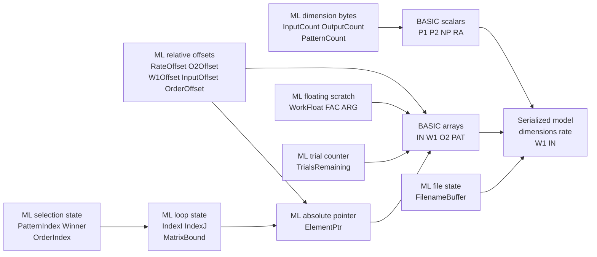

Activity nodes identify data access directly. `Reads` names the exact structures inspected without modification, `Writes` names the exact structures created or changed, and `Data access: none` marks control-only entry, exit, and transfer nodes.

## Public entry vectors

[DIPOLE.bas](../../combined/basic/DIPOLE.bas) is the behavioral source for the competitive-learning entry points. It executes initialization, pattern definition, and learning. Its REM interface block documents recognition and save/load. Each diagram expands the selected machine-language entry into its performed activities.

### `CL_Init`

Sources: [CL.ML.s lines 97-385](../../combined/asm/CL.ML.s#L97), [DIPOLE.bas line 60](../../combined/basic/DIPOLE.bas#L15)

**Work performed:** Initializes competitive-learning storage, creates random positive cluster weights, normalizes each cluster vector, and caches the work-array address and relative data offsets.

| Inputs / preconditions | Outputs / side effects |
| --- | --- |
| BASIC arguments `p1`, `p2`, `np`, and `rate`; BASIC storage; RND state | Dimension state and BASIC arrays created; cluster weights randomized and normalized; relative offsets cached |

**Data structures used:** BASIC caller constants and argument stream; BASIC RND state; P1, P2, NP; RA; O2; W1; IN; PAT; cached offsets

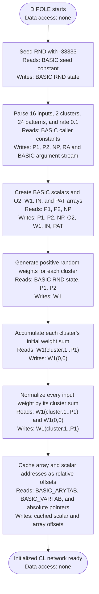

### `CL_Recognize`

Sources: [CL.ML.s lines 102-942](../../combined/asm/CL.ML.s#L102), [DIPOLE.bas REM line 16](../../combined/basic/DIPOLE.bas#L7)

**Work performed:** Converts an input bit string into scratch storage, calculates every cluster activation, selects the largest activation, and returns a one-hot winner in O2.

| Inputs / preconditions | Outputs / side effects |
| --- | --- |
| Initialized network and an input bit string of length P1 | Scratch `IN(:,0)` populated; `Winner` selected; one-hot cluster result stored in O2 |

**Data structures used:** BASIC input string; P1; PatternIndex; IN(:,0); W1; Winner; WorkFloat; O2

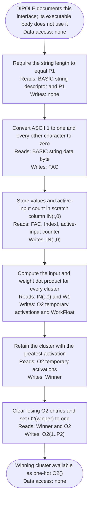

### `CL_Reserved1`

Source: [CL.ML.s lines 107-113](../../combined/asm/CL.ML.s#L107)

**Work performed:** Preserves the first unused public jump-table slot by executing two no-operation instructions and returning immediately.

| Inputs / preconditions | Outputs / side effects |
| --- | --- |
| None | No state change; returns after two NOP instructions |

**Data structures used:** 6502 processor state only


### `CL_Reserved2`

Source: [CL.ML.s lines 114-120](../../combined/asm/CL.ML.s#L114)

**Work performed:** Preserves the second unused public jump-table slot by executing two no-operation instructions and returning immediately.

| Inputs / preconditions | Outputs / side effects |
| --- | --- |
| None | No state change; returns after two NOP instructions |

**Data structures used:** 6502 processor state only

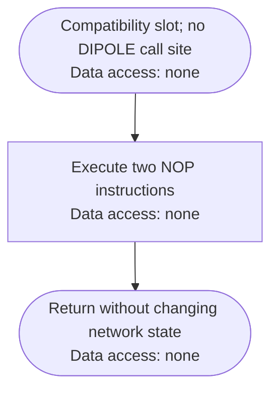

### `CL_Learn`

Sources: [CL.ML.s lines 121-855](../../combined/asm/CL.ML.s#L121), [DIPOLE.bas lines 330-610](../../combined/basic/DIPOLE.bas#L47)

**Work performed:** Runs requested learning passes by rebuilding and shuffling PAT, classifying every stored pattern, and moving only the winning cluster toward the normalized input vector.

| Inputs / preconditions | Outputs / side effects |
| --- | --- |
| BASIC trial count; initialized patterns, weights, and learning rate | Training epochs run until the encoded counter expires or RUN/STOP; winning-cluster weights updated |

**Data structures used:** BASIC trial-loop state; PatternCount; PAT; PatternIndex; IN; W1; O2; Winner; RA; BASIC RND and RUN/STOP state

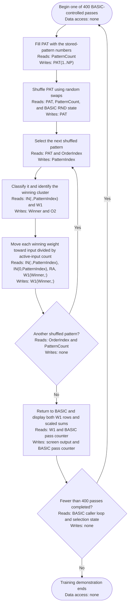

### `CL_DefinePattern`

Sources: [CL.ML.s lines 126-942](../../combined/asm/CL.ML.s#L126), [DIPOLE.bas lines 80-310](../../combined/basic/DIPOLE.bas#L19)

**Work performed:** Validates a pattern index, converts the supplied bit string into IN, counts active inputs, and stores that count in IN(0,pattern).

| Inputs / preconditions | Outputs / side effects |
| --- | --- |
| BASIC pattern number and input bit string | Selected IN column populated; active-input count stored in `IN(0,pattern)` |

**Data structures used:** BASIC caller pattern string and loop state; P1; NP; PatternIndex; IN

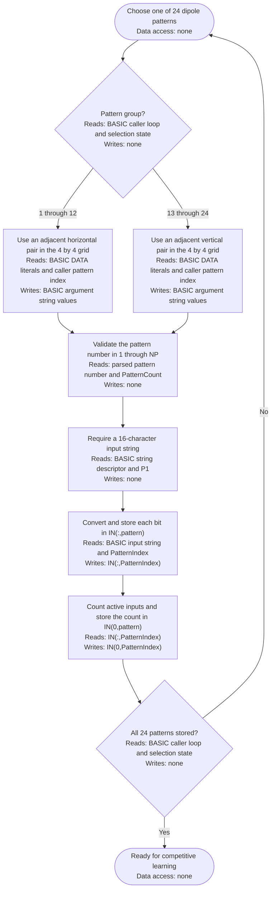

### `CL_Save`

Sources: [CL.ML.s lines 131-1080](../../combined/asm/CL.ML.s#L131), [DIPOLE.bas REM line 17](../../combined/basic/DIPOLE.bas#L8)

**Work performed:** Opens a sequential device-8 file and serializes the dimensions, learning rate, cluster weights, and stored input patterns.

| Inputs / preconditions | Outputs / side effects |
| --- | --- |
| BASIC filename; dimensions, rate, W1, IN, and device 8 | Sequential snapshot file written; data and status channels closed |

**Data structures used:** BASIC filename; FilenameBuffer; KERNAL channel state; drive status stream; P1, P2, NP; RA; W1; IN; snapshot stream

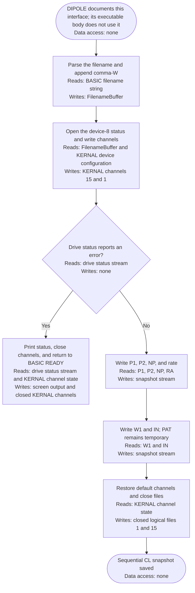

### `CL_Load`

Sources: [CL.ML.s lines 136-1251](../../combined/asm/CL.ML.s#L136), [DIPOLE.bas REM line 17](../../combined/basic/DIPOLE.bas#L8)

**Work performed:** Opens a saved competitive network, restores its dimensions, recreates BASIC storage, and reloads the learning rate, weights, and input patterns.

| Inputs / preconditions | Outputs / side effects |
| --- | --- |
| BASIC filename and readable device-8 snapshot | BASIC storage recreated; dimensions, rate, W1, and IN restored |

**Data structures used:** BASIC filename; FilenameBuffer; KERNAL channel state; drive status and snapshot streams; BASIC memory boundaries; P1, P2, NP; RA; W1; IN; PAT; cached offsets

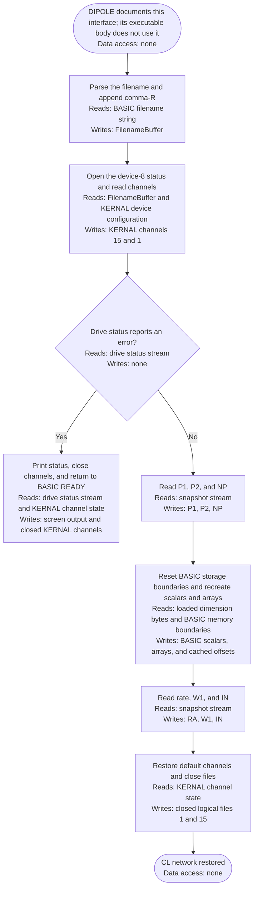

## Initialization and storage

### `InitializeNetwork`

Source: [CL.ML.s lines 141-175](../../combined/asm/CL.ML.s#L141)

**Work performed:** Parses the input count, cluster count, and pattern count as bytes and stores the floating-point learning rate.

| Inputs / preconditions | Outputs / side effects |
| --- | --- |
| BASIC parser at `p1,p2,np,rate`; BASIC memory; RND state | Counts and rate stored; arrays created; cluster vectors randomized and normalized; offsets made relative |

**Data structures used:** BASIC argument stream; SavedTextPtr; P1, P2, NP; RA offset and scalar

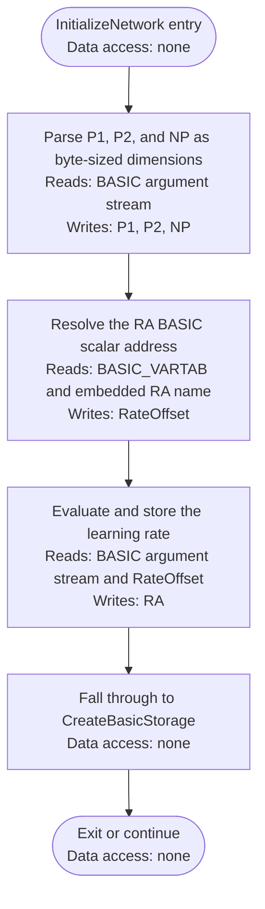

### `CreateBasicStorage`

Source: [CL.ML.s lines 176-258](../../combined/asm/CL.ML.s#L176)

**Work performed:** Creates BASIC scalars and dimensions O2, W1, IN, and the PAT work array needed by classification and training.

| Inputs / preconditions | Outputs / side effects |
| --- | --- |
| `InputCount`, `OutputCount`, and `PatternCount`; available BASIC variable/array memory | RA scalar plus O2, W1, IN, and PAT arrays created and located |

**Data structures used:** P1, P2, NP; BASIC_VARTAB; BASIC_ARYTAB; O2; W1; IN; PAT; cached offsets

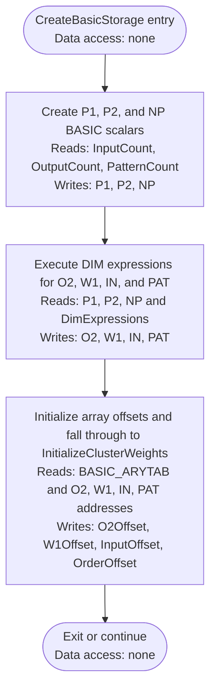

### `InitializeClusterWeights`

Source: [CL.ML.s lines 259-270](../../combined/asm/CL.ML.s#L259)

**Work performed:** Initializes every cluster by clearing its sum accumulator, generating random positive weights, and then normalizing the vector.

| Inputs / preconditions | Outputs / side effects |
| --- | --- |
| Allocated W1; input and cluster counts; RND state | Every cluster receives positive random weights and proceeds to normalization |

**Data structures used:** IndexI; IndexJ; OutputCount; W1(0,0); FAC

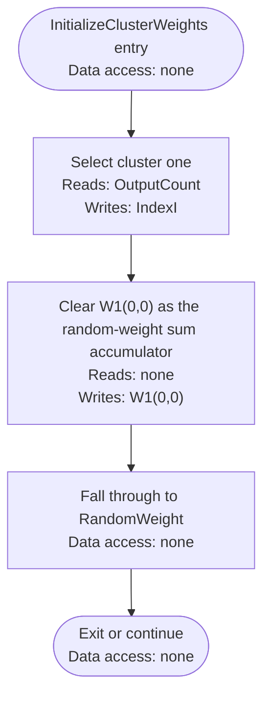

### `RandomWeight`

Source: [CL.ML.s lines 271-302](../../combined/asm/CL.ML.s#L271)

**Work performed:** Generates one positive random cluster weight with RND(1), stores it, and adds it to the cluster's normalization sum.

| Inputs / preconditions | Outputs / side effects |
| --- | --- |
| Current cluster/input indices; W1 element address; RND state | Positive random weight stored and added to `W1(0,0)` normalization sum |

**Data structures used:** IndexI; IndexJ; InputCount; OutputCount; W1; W1(0,0); ElementPtr; FAC; BASIC RND state

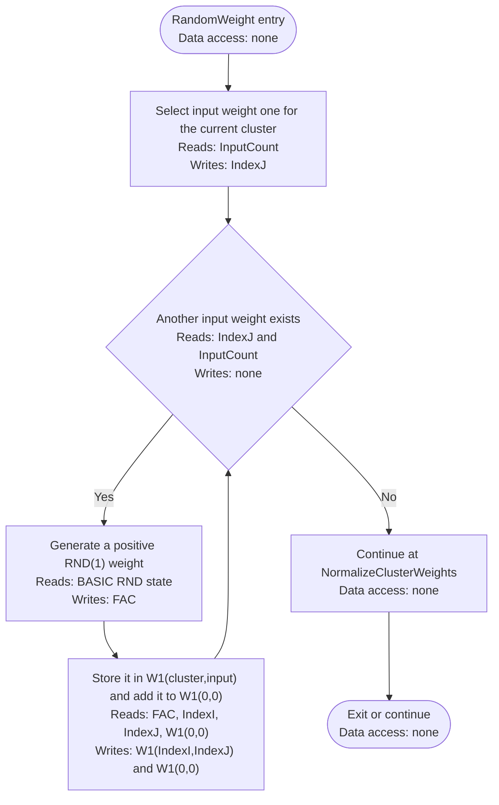

### `NormalizeClusterWeights`

Source: [CL.ML.s lines 303-334](../../combined/asm/CL.ML.s#L303)

**Work performed:** Divides every input weight in a cluster by the stored sum so the cluster vector totals one.

| Inputs / preconditions | Outputs / side effects |
| --- | --- |
| Current cluster; W1 weights and sum in `W1(0,0)` | Input weights divided by the sum so the cluster vector totals approximately one |

**Data structures used:** IndexI; IndexJ; InputCount; OutputCount; W1; W1(0,0); ElementPtr; FAC

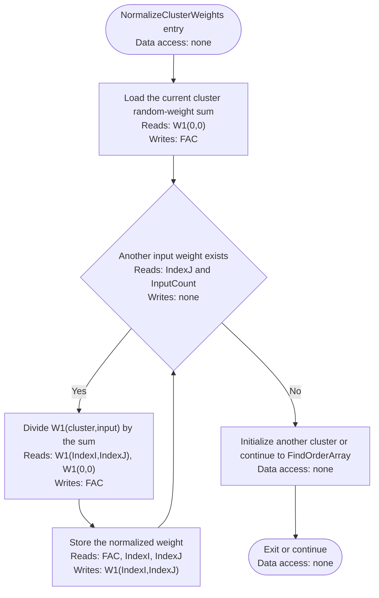

### `FindOrderArray`

Source: [CL.ML.s lines 335-385](../../combined/asm/CL.ML.s#L335)

**Work performed:** Caches the PAT work-array address and converts all cached array and scalar pointers to offsets relative to BASIC's storage bases.

| Inputs / preconditions | Outputs / side effects |
| --- | --- |
| Created PAT array and cached BASIC pointers | PAT address cached; scalar and array pointers converted to relative offsets |

**Data structures used:** BASIC_ARYTAB; BASIC_VARTAB; PAT absolute pointer; O2Offset; W1Offset; InputOffset; OrderOffset; RateOffset

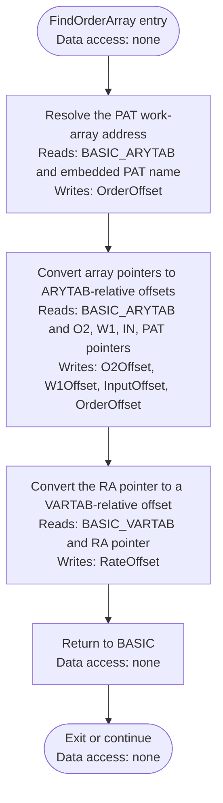

## Classification and math helpers

### `RecognizeString`

Source: [CL.ML.s lines 386-390](../../combined/asm/CL.ML.s#L386)

**Work performed:** Imports the supplied recognition string into scratch input column zero and classifies that scratch pattern.

| Inputs / preconditions | Outputs / side effects |
| --- | --- |
| BASIC input string and initialized network | `PatternIndex=0`; scratch input stored; classification produces `Winner` and one-hot O2 |

**Data structures used:** BASIC input string; PatternIndex; IN(:,0); W1; Winner; O2

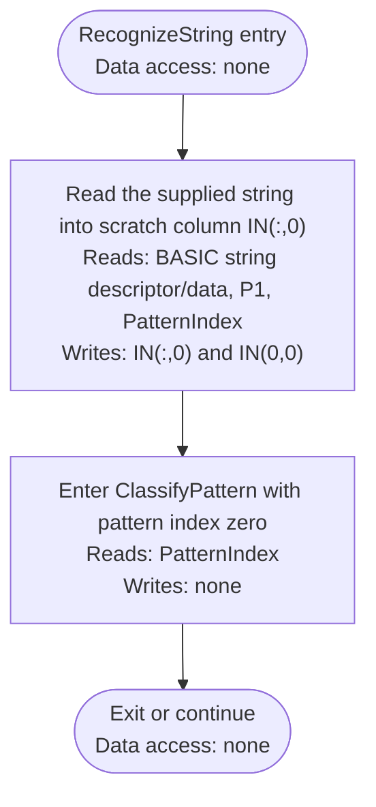

### `ClassifyPattern`

Source: [CL.ML.s lines 391-396](../../combined/asm/CL.ML.s#L391)

**Work performed:** Computes every cluster activation, retains the largest activation as the winner, stores the activations, and marks the winner.

| Inputs / preconditions | Outputs / side effects |
| --- | --- |
| `PatternIndex`; IN, W1, cluster and input counts | Every cluster activation evaluated; `Winner` selected; O2 converted to one-hot output |

**Data structures used:** PatternIndex; IndexI; Winner; IN; W1; O2; WorkFloat; FAC

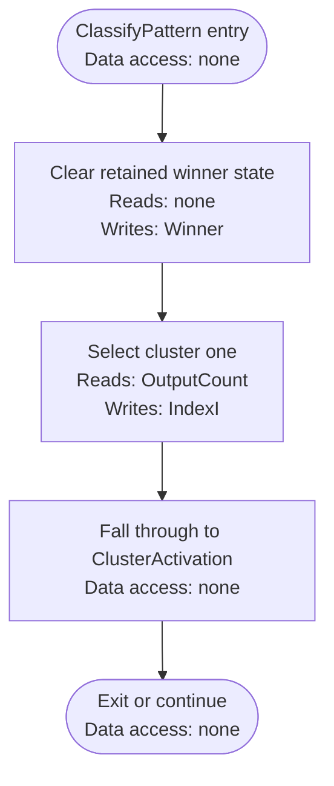

### `ClusterActivation`

Source: [CL.ML.s lines 397-441](../../combined/asm/CL.ML.s#L397)

**Work performed:** Clears a cluster's accumulator and calculates its dot product with the selected input pattern.

| Inputs / preconditions | Outputs / side effects |
| --- | --- |
| Current cluster `IndexI`; selected pattern; W1 and IN | Dot-product activation accumulated in FAC; control continues to winner selection |

**Data structures used:** PatternIndex; IndexI; IndexJ; InputCount; W1; IN; WorkFloat; FAC

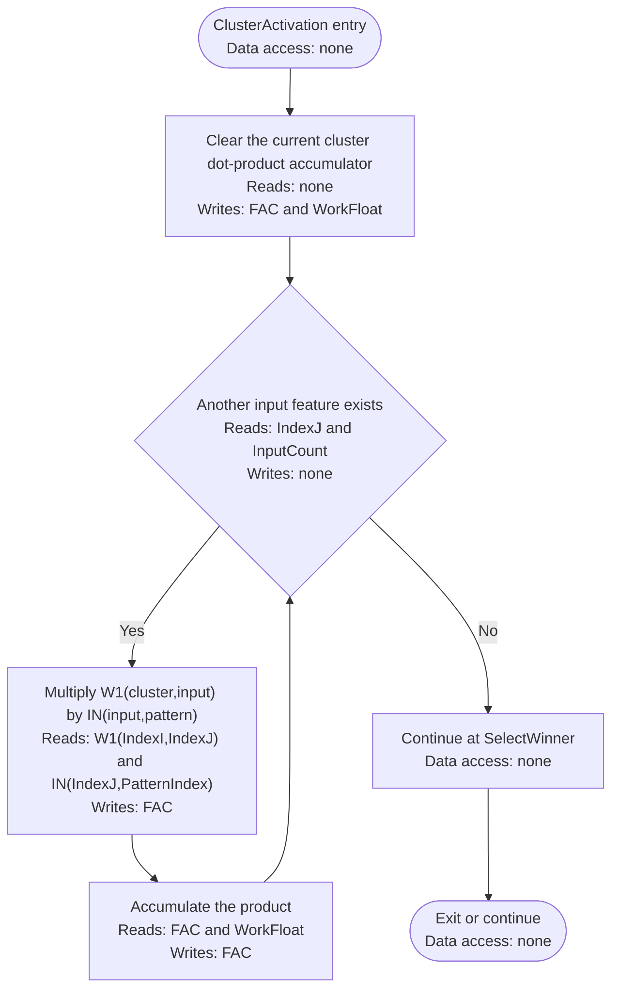

### `SelectWinner`

Source: [CL.ML.s lines 442-483](../../combined/asm/CL.ML.s#L442)

**Work performed:** Compares the current cluster activation with the retained best value and keeps the earlier cluster unless the new value is strictly larger.

| Inputs / preconditions | Outputs / side effects |
| --- | --- |
| Current activation in FAC; current `Winner`; retained O2 activation | Winner and retained activation updated only when the new cluster is strictly larger |

**Data structures used:** IndexI; Winner; O2; WorkFloat; FAC; ElementPtr

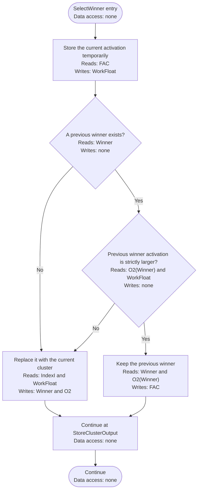

### `StoreClusterOutput`

Source: [CL.ML.s lines 484-504](../../combined/asm/CL.ML.s#L484)

**Work performed:** Stores the retained activation for the current winner candidate in O2 and writes zero for a losing cluster.

| Inputs / preconditions | Outputs / side effects |
| --- | --- |
| Current cluster index and retained activation or zero in FAC | Value stored in `O2(IndexI)`; iteration advances or transfers to `MarkWinner` |

**Data structures used:** IndexI; OutputCount; Winner; O2; FAC; ElementPtr

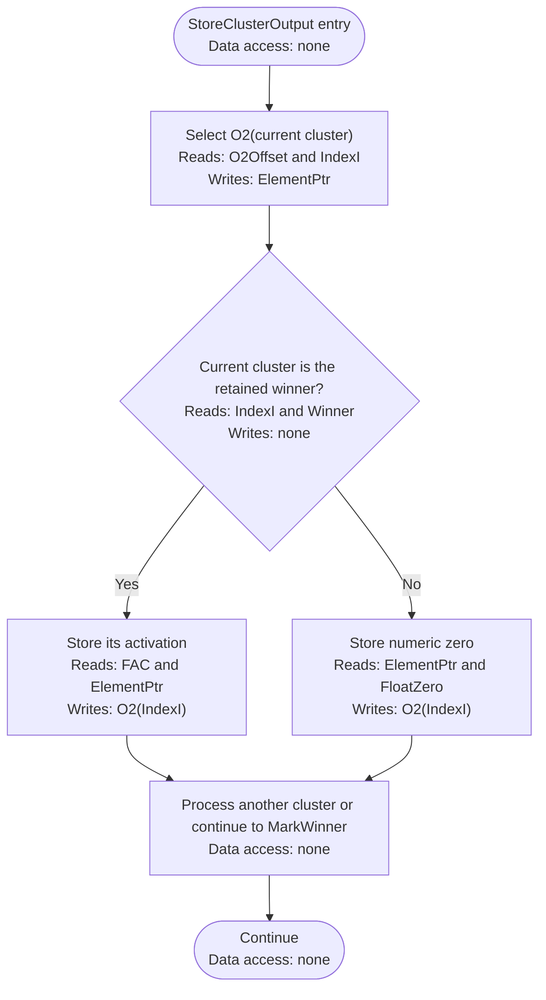

### `MarkWinner`

Source: [CL.ML.s lines 505-523](../../combined/asm/CL.ML.s#L505)

**Work performed:** Writes one to O2 at the winning cluster index, leaving the other cluster outputs cleared for a one-hot result.

| Inputs / preconditions | Outputs / side effects |
| --- | --- |
| Final `Winner` index and O2 array | `O2(Winner)=1`; classification returns with one-hot output |

**Data structures used:** Winner; O2; FAC; ElementPtr

```mermaid
flowchart TD
    A(["MarkWinner entry<br/>Data access: none"]) --> B["Select O2(Winner)<br/>Reads: O2Offset and Winner<br/>Writes: ElementPtr"]
    B --> C["Store numeric one<br/>Reads: FloatOne and ElementPtr<br/>Writes: O2(Winner)"]
    C --> D["Return with one-hot cluster output<br/>Reads: O2 and Winner<br/>Writes: none"]
    D --> Z(["Exit or continue<br/>Data access: none"])
```

### `IndexVector`

Source: [CL.ML.s lines 524-544](../../combined/asm/CL.ML.s#L524)

**Work performed:** Converts a one-dimensional BASIC array index into a byte address by adding five bytes per floating-point element.

| Inputs / preconditions | Outputs / side effects |
| --- | --- |
| Base address in `ElementPtr`; vector index in A | `ElementPtr` advanced by five bytes per element to the indexed BASIC float |

**Data structures used:** A register; ElementPtr

```mermaid
flowchart TD
    A(["IndexVector entry<br/>Data access: none"]) --> B["Multiply vector index A by five bytes<br/>Reads: A register<br/>Writes: A register and carry state"]
    B --> C["Add the displacement to ElementPtr<br/>Reads: A register and ElementPtr<br/>Writes: ElementPtr"]
    C --> D["Return with ElementPtr at the BASIC floating-point element<br/>Reads: ElementPtr<br/>Writes: none"]
    D --> Z(["Exit or continue<br/>Data access: none"])
```

### `IndexMatrix`

Source: [CL.ML.s lines 545-580](../../combined/asm/CL.ML.s#L545)

**Work performed:** Converts two BASIC array indices into a row-major byte address using five-byte floating-point elements.

| Inputs / preconditions | Outputs / side effects |
| --- | --- |
| Base address in `ElementPtr`; dimension bound in A; matrix indices in X and Y | `ElementPtr` advanced to element `X*(A+1)+Y` using five-byte BASIC floats |

**Data structures used:** A, X, and Y registers; MatrixBound; ElementPtr

```mermaid
flowchart TD
    A(["IndexMatrix entry<br/>Data access: none"]) --> B["Compute X times first-dimension span plus Y<br/>Reads: A, X, and Y registers<br/>Writes: MatrixBound and A register"]
    B --> C["Pass the linear element index to IndexVector<br/>Reads: A register and ElementPtr<br/>Writes: ElementPtr"]
    C --> D["Return with ElementPtr at the matrix element<br/>Reads: ElementPtr<br/>Writes: none"]
    D --> Z(["Exit or continue<br/>Data access: none"])
```

### `PrintFloatUnused`

Source: [CL.ML.s lines 581-600](../../combined/asm/CL.ML.s#L581)

**Work performed:** Formats the floating-point accumulator and sends it through BASIC string output; the competitive-learning code does not call this helper.

| Inputs / preconditions | Outputs / side effects |
| --- | --- |
| Floating-point value in FAC | Value formatted and printed through BASIC string output; helper is unused by CL internally |

**Data structures used:** FAC; BASIC_PRINT_BUFFER; BASIC string output

```mermaid
flowchart TD
    A(["PrintFloatUnused entry<br/>Data access: none"]) --> B["Format FAC into the BASIC print buffer<br/>Reads: FAC<br/>Writes: BASIC_PRINT_BUFFER"]
    B --> C["Print the BASIC string<br/>Reads: BASIC_PRINT_BUFFER<br/>Writes: screen output"]
    C --> D["Return; no internal routine calls this helper<br/>Data access: none"]
    D --> Z(["Exit or continue<br/>Data access: none"])
```

## Competitive learning

### `TrainEpoch`

Source: [CL.ML.s lines 601-625](../../combined/asm/CL.ML.s#L601)

**Work performed:** Fills PAT with pattern numbers, shuffles their order, classifies each pattern, and updates its winning cluster.

| Inputs / preconditions | Outputs / side effects |
| --- | --- |
| Stored patterns, current W1, rate, PAT work array, and RND state | PAT rebuilt and shuffled; every pattern presented once; winning cluster weights updated |

**Data structures used:** PatternCount; IndexI; PAT

```mermaid
flowchart TD
    A(["TrainEpoch entry<br/>Data access: none"]) --> B["Set PAT(i) equal to i for all stored patterns<br/>Reads: PatternCount<br/>Writes: PAT(1..NP)"]
    B --> C{"Another PAT position needs initialization<br/>Reads: IndexI and PatternCount<br/>Writes: none"}
    C -- Yes --> D["Store the next sequential pattern number<br/>Reads: IndexI<br/>Writes: PAT(IndexI)"]
    D --> E["Advance the PAT index<br/>Reads: IndexI<br/>Writes: IndexI"]
    E --> C
    C -- No --> F["Continue at ShufflePatterns<br/>Data access: none"]
    F --> Z(["Exit or continue<br/>Data access: none"])
```

### `ShufflePatterns`

Source: [CL.ML.s lines 626-693](../../combined/asm/CL.ML.s#L626)

**Work performed:** Performs an in-place random shuffle by swapping each PAT entry with a randomly chosen remaining entry.

| Inputs / preconditions | Outputs / side effects |
| --- | --- |
| Pattern count, PAT array, and RND state | PAT changed to an in-place random permutation of pattern numbers 1 through NP |

**Data structures used:** PatternCount; IndexI; IndexJ; PAT; FAC; BASIC RND state

```mermaid
flowchart TD
    A(["ShufflePatterns entry<br/>Data access: none"]) --> B["Select shuffle position i<br/>Reads: PatternCount<br/>Writes: IndexI"]
    B --> C{"Another shuffle position exists<br/>Reads: IndexI and PatternCount<br/>Writes: none"}
    C -- Yes --> D["Choose j as i plus INT of RND times remaining count<br/>Reads: IndexI, PatternCount, and BASIC RND state<br/>Writes: IndexJ"]
    D --> E["Swap PAT(i) and PAT(j)<br/>Reads: PAT(IndexI) and PAT(IndexJ)<br/>Writes: PAT(IndexI) and PAT(IndexJ)"]
    E --> F["Advance i<br/>Reads: IndexI<br/>Writes: IndexI"]
    F --> C
    C -- No --> G["Continue at PresentShuffledPatterns<br/>Data access: none"]
    G --> Z(["Exit or continue<br/>Data access: none"])
```

### `PresentShuffledPatterns`

Source: [CL.ML.s lines 694-734](../../combined/asm/CL.ML.s#L694)

**Work performed:** Reads the next shuffled pattern number from PAT, classifies that pattern, and invokes the winning-cluster update.

| Inputs / preconditions | Outputs / side effects |
| --- | --- |
| Shuffled PAT, `OrderIndex`, IN, W1, and rate | Next pattern classified; its winning cluster updated; presentation index advanced |

**Data structures used:** PAT; OrderIndex; PatternIndex; IN; W1; O2; Winner

```mermaid
flowchart TD
    A(["PresentShuffledPatterns entry<br/>Data access: none"]) --> B["Read the first shuffled pattern number from PAT<br/>Reads: PAT(1)<br/>Writes: OrderIndex and PatternIndex"]
    B --> C{"Another shuffled pattern exists<br/>Reads: OrderIndex and PatternCount<br/>Writes: none"}
    C -- Yes --> D["Set PatternIndex and call ClassifyPattern<br/>Reads: PAT(OrderIndex)<br/>Writes: PatternIndex, Winner, O2"]
    D --> E["Resolve the winning cluster's weights<br/>Reads: W1Offset and Winner<br/>Writes: ElementPtr"]
    E --> C
    C -- No --> F["Continue at UpdateWinningCluster<br/>Data access: none"]
    F --> Z(["Exit or continue<br/>Data access: none"])
```

### `UpdateWinningCluster`

Source: [CL.ML.s lines 735-825](../../combined/asm/CL.ML.s#L735)

**Work performed:** Moves each weight of the winning cluster toward the input's active-bit-normalized target using the learning rate.

| Inputs / preconditions | Outputs / side effects |
| --- | --- |
| `Winner`, `PatternIndex`, rate, W1, IN, and active count `IN(0,pattern)` | Each input weight of the winner moved toward the normalized active-bit target |

**Data structures used:** PatternIndex; Winner; IndexI; InputCount; IN; RA; W1; WorkFloat; FAC

```mermaid
flowchart TD
    A(["UpdateWinningCluster entry<br/>Data access: none"]) --> B["Select input feature one for the winning cluster<br/>Reads: InputCount and Winner<br/>Writes: IndexI"]
    B --> C{"Another input feature exists<br/>Reads: IndexI and InputCount<br/>Writes: none"}
    C -- Yes --> D["Compute target as IN(input,pattern) divided by active-input count IN(0,pattern)<br/>Reads: IN(IndexI,PatternIndex) and IN(0,PatternIndex)<br/>Writes: FAC and WorkFloat"]
    D --> E["Compute rate times target minus current weight<br/>Reads: RA, WorkFloat, and W1(Winner,IndexI)<br/>Writes: FAC"]
    E --> F["Add the adjustment to W1(winner,input)<br/>Reads: FAC and W1(Winner,IndexI)<br/>Writes: W1(Winner,IndexI)"]
    F --> C
    C -- No --> G["Advance to the next shuffled pattern or return<br/>Reads: OrderIndex and PatternCount<br/>Writes: OrderIndex"]
    G --> Z(["Exit or continue<br/>Data access: none"])
```

### `LearnTrials`

Source: [CL.ML.s lines 826-855](../../combined/asm/CL.ML.s#L826)

**Work performed:** Parses the requested trial count, repeatedly runs training epochs, and polls RUN/STOP between passes using the original counter behavior.

| Inputs / preconditions | Outputs / side effects |
| --- | --- |
| Numeric BASIC trial count and initialized training state | Epoch counter loaded and decremented; W1 updated across passes; RUN/STOP may terminate processing |

**Data structures used:** BASIC numeric argument; TrialsRemaining; training arrays; KERNAL RUN/STOP state

```mermaid
flowchart TD
    A(["LearnTrials entry<br/>Data access: none"]) --> B["Parse the requested trial count as a word<br/>Reads: BASIC numeric argument<br/>Writes: TrialsRemaining"]
    B --> C{"Remaining trial count is zero?<br/>Reads: TrialsRemaining<br/>Writes: none"}
    C -- Yes --> Z(["Return to BASIC<br/>Data access: none"])
    C -- No --> D["Run one TrainEpoch<br/>Reads: PAT, IN, W1, RA, PatternCount<br/>Writes: PAT, Winner, O2, W1"] --> E["Poll RUN/STOP<br/>Reads: KERNAL RUN/STOP state<br/>Writes: none"]
    E --> F{"RUN/STOP is pressed?<br/>Reads: KERNAL RUN/STOP state<br/>Writes: none"}
    F -- Yes --> X["Transfer to BASIC break handling<br/>Data access: none"] --> Y(["Break exit<br/>Data access: none"])
    F -- No --> G["Decrement using the preserved original counter logic<br/>Reads: TrialsRemaining<br/>Writes: TrialsRemaining"] --> C
```

## Pattern definition

### `DefinePattern`

Source: [CL.ML.s lines 856-869](../../combined/asm/CL.ML.s#L856)

**Work performed:** Validates a pattern index from 1 through NP and then reads its input string into the pattern matrix.

| Inputs / preconditions | Outputs / side effects |
| --- | --- |
| Numeric BASIC pattern argument followed by an input string | Pattern validated; selected IN column and its active-input count populated |

**Data structures used:** BASIC numeric argument and string; PatternCount; PatternIndex; P1; IN

```mermaid
flowchart TD
    A(["DefinePattern entry<br/>Data access: none"]) --> B["Parse the stored pattern number<br/>Reads: BASIC numeric argument and PatternCount<br/>Writes: PatternIndex"]
    B --> C{"Pattern number is in 1 through NP?<br/>Reads: parsed pattern number and PatternCount<br/>Writes: none"}
    C -- Yes --> D["Set PatternIndex and enter ReadInputString<br/>Reads: parsed pattern number<br/>Writes: PatternIndex"] --> Z(["Continue<br/>Data access: none"])
    C -- No --> E["Raise BASIC illegal quantity error<br/>Data access: none"] --> X(["BASIC error<br/>Data access: none"])
```

### `ReadInputString`

Source: [CL.ML.s lines 870-893](../../combined/asm/CL.ML.s#L870)

**Work performed:** Requires an input string of length P1, converts its characters to binary values, and prepares to count active inputs.

| Inputs / preconditions | Outputs / side effects |
| --- | --- |
| `PatternIndex`; BASIC string descriptor; expected length P1 | Input characters converted to binary values in IN; processing continues to active-input counting |

**Data structures used:** BASIC parser and string descriptor/data; P1; PatternIndex; IndexI; IN

```mermaid
flowchart TD
    A(["ReadInputString entry<br/>Data access: none"]) --> B["Evaluate and require a string<br/>Reads: BASIC parser input<br/>Writes: BASIC string descriptor and data pointer"]
    B --> C{"String length equals P1?<br/>Reads: BASIC string descriptor and P1<br/>Writes: none"}
    C -- Yes --> D["Initialize input and active-count indices<br/>Reads: none<br/>Writes: IndexI and active-input counter"] --> E["Enter CountActiveInputs<br/>Data access: none"] --> Z(["Continue<br/>Data access: none"])
    C -- No --> X["Raise BASIC illegal quantity error<br/>Data access: none"] --> Y(["BASIC error<br/>Data access: none"])
```

### `CountActiveInputs`

Source: [CL.ML.s lines 894-918](../../combined/asm/CL.ML.s#L894)

**Work performed:** Counts characters equal to ASCII 1 while writing one for active inputs and zero for all other characters.

| Inputs / preconditions | Outputs / side effects |
| --- | --- |
| Input string data and selected IN column | `IN(1..P1,pattern)` filled; active ASCII-1 characters counted |

**Data structures used:** BASIC string data; PatternIndex; IndexI; InputCount; active-input counter; IN; FAC

```mermaid
flowchart TD
    A(["CountActiveInputs entry<br/>Data access: none"]) --> B["Clear the active-input counter<br/>Reads: none<br/>Writes: active-input counter"]
    B --> C{"Another input character exists<br/>Reads: IndexI, BASIC string length, and string data pointer<br/>Writes: none"}
    C -- Yes --> D["Convert ASCII 1 to numeric one and every other character to zero<br/>Reads: BASIC string data byte<br/>Writes: FAC"]
    D --> E["Store IN(input,PatternIndex) and increment the counter for ASCII 1<br/>Reads: FAC, PatternIndex, IndexI, ASCII byte<br/>Writes: IN(IndexI,PatternIndex) and active-input counter"]
    E --> C
    C -- No --> F["Continue at StoreActiveCount<br/>Data access: none"]
    F --> Z(["Exit or continue<br/>Data access: none"])
```

### `StoreActiveCount`

Source: [CL.ML.s lines 919-942](../../combined/asm/CL.ML.s#L919)

**Work performed:** Stores the active-input count in IN(0,pattern) and raises an error when the pattern contains no active inputs.

| Inputs / preconditions | Outputs / side effects |
| --- | --- |
| Active-input count and `PatternIndex` | Count stored in `IN(0,pattern)`, or BASIC illegal-quantity error raised when the count is zero |

**Data structures used:** PatternIndex; active-input counter; IN(0,PatternIndex)

```mermaid
flowchart TD
    A(["StoreActiveCount entry<br/>Data access: none"]) --> C{"Active-input count is nonzero?<br/>Reads: active-input counter<br/>Writes: none"}
    C -- Yes --> D["Store the count in IN(0,PatternIndex)<br/>Reads: active-input counter and PatternIndex<br/>Writes: IN(0,PatternIndex)"] --> Z(["Return<br/>Data access: none"])
    C -- No --> X["Raise BASIC illegal quantity error<br/>Data access: none"] --> Y(["BASIC error<br/>Data access: none"])
```

## Persistence

### `SaveNetwork`

Source: [CL.ML.s lines 943-983](../../combined/asm/CL.ML.s#L943)

**Work performed:** Builds the sequential-file write name, opens the data and status channels, writes the network body, and closes both channels.

| Inputs / preconditions | Outputs / side effects |
| --- | --- |
| BASIC filename; in-memory dimensions, rate, W1, IN; device 8 | Write-mode data file and status channel opened; serialized body written; channels closed |

**Data structures used:** BASIC filename; FilenameBuffer; KERNAL file and status channels; drive status stream; in-memory CL snapshot data

```mermaid
flowchart TD
    A(["SaveNetwork entry<br/>Data access: none"]) --> B["Open the device-8 status channel<br/>Reads: FilenameBuffer and KERNAL device configuration<br/>Writes: KERNAL status channel 15"]
    B --> C["Parse the filename and append comma-W<br/>Reads: BASIC filename string<br/>Writes: FilenameBuffer"] --> D["Open logical file 1 for writing<br/>Reads: FilenameBuffer and KERNAL device configuration<br/>Writes: KERNAL file 1 output channel"]
    D --> E{"Drive status reports an error?<br/>Reads: drive status stream<br/>Writes: none"}
    E -- No --> F["Continue at WriteNetworkBody<br/>Data access: none"] --> Z(["Continue<br/>Data access: none"])
    E -- Yes --> X["Enter DiskError<br/>Data access: none"] --> Y(["Error exit<br/>Data access: none"])
```

### `WriteNetworkBody`

Source: [CL.ML.s lines 984-1014](../../combined/asm/CL.ML.s#L984)

**Work performed:** Writes P1, P2, NP, the learning rate, W1, and IN in snapshot order while leaving the temporary PAT array out of the file.

| Inputs / preconditions | Outputs / side effects |
| --- | --- |
| Open KERNAL output channel; P1/P2/NP, RA, W1, and IN | Snapshot byte stream emitted in load-compatible order; temporary PAT is not saved |

**Data structures used:** KERNAL output channel; P1, P2, NP; RA; W1; IN; BASIC_INDEX; snapshot stream

```mermaid
flowchart TD
    A(["WriteNetworkBody entry<br/>Data access: none"]) --> B["Select logical file 1 as output<br/>Reads: KERNAL file 1 state<br/>Writes: active KERNAL output channel"]
    B --> C["Write P1, P2, and NP bytes<br/>Reads: P1, P2, NP<br/>Writes: snapshot stream"]
    C --> D["Write the RA scalar<br/>Reads: RA and RateOffset<br/>Writes: snapshot stream"]
    D --> E["Write W1 and IN matrices<br/>Reads: W1, IN and matrix offsets<br/>Writes: snapshot stream"]
    E --> F["Tail-call CloseNetworkFiles<br/>Data access: none"]
    F --> Z(["Exit or continue<br/>Data access: none"])
```

### `WriteScalar`

Source: [CL.ML.s lines 1015-1033](../../combined/asm/CL.ML.s#L1015)

**Work performed:** Resolves a BASIC scalar's relative address and writes its five-byte floating-point representation to the open file.

| Inputs / preconditions | Outputs / side effects |
| --- | --- |
| Selected scalar offset relative to `BASIC_VARTAB`; open output channel | Five-byte BASIC floating-point scalar written to the file |

**Data structures used:** BASIC_VARTAB; scalar offset in X/Y; IndexI; KERNAL output channel; snapshot stream

```mermaid
flowchart TD
    A(["WriteScalar entry<br/>Data access: none"]) --> B["Resolve the VARTAB-relative scalar address<br/>Reads: BASIC_VARTAB and scalar offset in X/Y<br/>Writes: BASIC_INDEX"]
    B --> C{"Fewer than five bytes have been written<br/>Reads: IndexI<br/>Writes: none"}
    C -- Yes --> D["Write the next stored floating-point byte<br/>Reads: BASIC scalar byte at BASIC_INDEX+IndexI<br/>Writes: snapshot stream"]
    D --> E["Advance the byte index<br/>Reads: IndexI<br/>Writes: IndexI"]
    E --> C
    C -- No --> F["Return<br/>Data access: none"]
    F --> Z(["Exit or continue<br/>Data access: none"])
```

### `WriteMatrix`

Source: [CL.ML.s lines 1034-1068](../../combined/asm/CL.ML.s#L1034)

**Work performed:** Resolves a BASIC matrix address and writes every allocated five-byte element, including index-zero rows and columns.

| Inputs / preconditions | Outputs / side effects |
| --- | --- |
| Selected array offset, bounds, and dimensions; open output channel | Every allocated five-byte matrix element written, including index-zero storage |

**Data structures used:** BASIC_ARYTAB; BASIC_INDEX; MatrixBound; IndexI; IndexJ; KERNAL output channel; snapshot stream

```mermaid
flowchart TD
    A(["WriteMatrix entry<br/>Data access: none"]) --> B["Resolve the ARYTAB-relative matrix address and allocated bounds<br/>Reads: BASIC_ARYTAB, BASIC_INDEX, X, and Y bounds<br/>Writes: BASIC_INDEX, MatrixBound, IndexI, IndexJ"]
    B --> C{"Another allocated element byte exists<br/>Reads: IndexI, IndexJ, MatrixBound, and matrix bounds<br/>Writes: none"}
    C -- Yes --> D["Write the next byte through CHROUT<br/>Reads: matrix byte at BASIC_INDEX<br/>Writes: snapshot stream"]
    D --> E["Advance byte, element, and dimension counters<br/>Reads: IndexI, IndexJ, MatrixBound<br/>Writes: IndexI, IndexJ, BASIC_INDEX"]
    E --> C
    C -- No --> F["Return<br/>Data access: none"]
    F --> Z(["Exit or continue<br/>Data access: none"])
```

### `DiskError`

Source: [CL.ML.s lines 1069-1080](../../combined/asm/CL.ML.s#L1069)

**Work performed:** Prints the disk status, restores normal channels, closes the network files, resets the stack, and returns BASIC to READY.

| Inputs / preconditions | Outputs / side effects |
| --- | --- |
| Disk status channel and possibly open data channel | Drive status printed; channels closed; stack reset; control returned to BASIC READY |

**Data structures used:** KERNAL status input channel; drive status stream; screen output; KERNAL channel state; BASIC stack

```mermaid
flowchart TD
    A(["DiskError entry<br/>Data access: none"]) --> B["Read drive status channel<br/>Reads: KERNAL status channel 15<br/>Writes: drive status byte"]
    B --> C{"Next status byte is not carriage return<br/>Reads: drive status byte<br/>Writes: none"}
    C -- Yes --> D["Print the status byte<br/>Reads: drive status byte<br/>Writes: screen output"]
    D --> E["Read the next byte<br/>Reads: KERNAL status channel 15<br/>Writes: drive status byte"]
    E --> C
    C -- No --> F["Close all channels, reset the BASIC stack, and return to READY<br/>Reads: KERNAL channel state and BASIC stack<br/>Writes: closed channels, reset BASIC stack, READY state"]
    F --> Z(["Exit or continue<br/>Data access: none"])
```

### `LoadNetwork`

Source: [CL.ML.s lines 1081-1148](../../combined/asm/CL.ML.s#L1081)

**Work performed:** Builds the sequential-file read name, opens the file, reads dimensions, recreates BASIC storage, and restores the learning rate and matrices.

| Inputs / preconditions | Outputs / side effects |
| --- | --- |
| BASIC filename; device-8 snapshot; BASIC memory boundaries | Read-mode channels opened; dimensions read; storage recreated; rate, W1, and IN restored |

**Data structures used:** BASIC filename; FilenameBuffer; KERNAL channels; drive status and snapshot streams; loaded counts; BASIC memory; persisted CL data

```mermaid
flowchart TD
    A(["LoadNetwork entry<br/>Data access: none"]) --> B["Open the device-8 status channel<br/>Reads: FilenameBuffer and KERNAL device configuration<br/>Writes: KERNAL status channel 15"]
    B --> C["Parse the filename and append comma-R<br/>Reads: BASIC filename string<br/>Writes: FilenameBuffer"] --> D["Open logical file 1 for reading<br/>Reads: FilenameBuffer and KERNAL device configuration<br/>Writes: KERNAL file 1 input channel"]
    D --> E{"Drive status reports an error?<br/>Reads: drive status stream<br/>Writes: none"}
    E -- Yes --> X["Enter DiskError<br/>Data access: none"] --> Y(["Error exit<br/>Data access: none"])
    E -- No --> F["Read P1, P2, and NP<br/>Reads: snapshot stream<br/>Writes: P1, P2, NP"] --> G["Recreate BASIC storage<br/>Reads: loaded P1, P2, NP and BASIC memory boundaries<br/>Writes: CL BASIC scalars, arrays, initialization state, and cached offsets"] --> H["Read RA, W1, and IN<br/>Reads: snapshot stream<br/>Writes: RA, W1, IN"] --> I["Tail-call CloseNetworkFiles<br/>Data access: none"] --> Z(["Close and return<br/>Data access: none"])
```

### `ReadScalar`

Source: [CL.ML.s lines 1149-1167](../../combined/asm/CL.ML.s#L1149)

**Work performed:** Reads five bytes from the open file into the addressed BASIC floating-point scalar.

| Inputs / preconditions | Outputs / side effects |
| --- | --- |
| Selected scalar offset relative to `BASIC_VARTAB`; open input channel | Five bytes read into the BASIC scalar |

**Data structures used:** BASIC_VARTAB; scalar offset in X/Y; IndexI; KERNAL input channel; snapshot stream

```mermaid
flowchart TD
    A(["ReadScalar entry<br/>Data access: none"]) --> B["Resolve the VARTAB-relative scalar address<br/>Reads: BASIC_VARTAB and scalar offset in X/Y<br/>Writes: BASIC_INDEX"]
    B --> C{"Fewer than five bytes have been read<br/>Reads: IndexI<br/>Writes: none"}
    C -- Yes --> D["Read the next byte through CHRIN<br/>Reads: snapshot stream<br/>Writes: input byte"]
    D --> E["Store it and advance the byte index<br/>Reads: IndexI<br/>Writes: IndexI"]
    E --> C
    C -- No --> F["Return<br/>Data access: none"]
    F --> Z(["Exit or continue<br/>Data access: none"])
```

### `ReadMatrix`

Source: [CL.ML.s lines 1168-1202](../../combined/asm/CL.ML.s#L1168)

**Work performed:** Reads five-byte floating-point values into every allocated element of the addressed BASIC matrix.

| Inputs / preconditions | Outputs / side effects |
| --- | --- |
| Selected array offset, bounds, and dimensions; open input channel | Five-byte values read into every allocated matrix element |

**Data structures used:** BASIC_ARYTAB; BASIC_INDEX; MatrixBound; IndexI; IndexJ; KERNAL input channel; snapshot stream

```mermaid
flowchart TD
    A(["ReadMatrix entry<br/>Data access: none"]) --> B["Resolve the ARYTAB-relative matrix address and allocated bounds<br/>Reads: BASIC_ARYTAB, BASIC_INDEX, X, and Y bounds<br/>Writes: BASIC_INDEX, MatrixBound, IndexI, IndexJ"]
    B --> C{"Another allocated element byte exists<br/>Reads: IndexI, IndexJ, MatrixBound, and matrix bounds<br/>Writes: none"}
    C -- Yes --> D["Read and store the next byte<br/>Reads: snapshot stream and BASIC_INDEX<br/>Writes: matrix byte at BASIC_INDEX"]
    D --> E["Advance byte, element, and dimension counters<br/>Reads: IndexI, IndexJ, MatrixBound<br/>Writes: IndexI, IndexJ, BASIC_INDEX"]
    E --> C
    C -- No --> F["Return<br/>Data access: none"]
    F --> Z(["Exit or continue<br/>Data access: none"])
```

### `RecreateForLoad`

Source: [CL.ML.s lines 1203-1229](../../combined/asm/CL.ML.s#L1203)

**Work performed:** Resets BASIC's array and string boundaries, recreates competitive-network storage from loaded dimensions, and refreshes cached offsets.

| Inputs / preconditions | Outputs / side effects |
| --- | --- |
| Loaded dimension counts; current BASIC array/string boundaries | Old array/string space reset; CL storage recreated; cluster initialization overwritten by loaded data; offsets refreshed |

**Data structures used:** Loaded P1, P2, NP bytes; BASIC_STREND; BASIC_FRETOP; BASIC_MEMSIZ; BASIC scalars and arrays; cached offsets

```mermaid
flowchart TD
    A(["RecreateForLoad entry<br/>Data access: none"]) --> B["Reset BASIC array and string boundaries<br/>Reads: BASIC_STREND and BASIC_MEMSIZ<br/>Writes: BASIC_STREND and BASIC_FRETOP"]
    B --> C["Recreate dimension scalars from the loaded byte values<br/>Reads: P1, P2, NP loaded bytes<br/>Writes: P1, P2, NP BASIC scalars"]
    C --> D["Call CreateBasicStorage to DIM arrays and rebuild offsets<br/>Reads: P1, P2, NP<br/>Writes: CL BASIC arrays and cached offsets"]
    D --> E["Return<br/>Data access: none"]
    E --> Z(["Exit or continue<br/>Data access: none"])
```

### `OpenStatusChannel`

Source: [CL.ML.s lines 1230-1241](../../combined/asm/CL.ML.s#L1230)

**Work performed:** Opens logical file 15 on device 8 with secondary address 15 for disk-drive status reporting.

| Inputs / preconditions | Outputs / side effects |
| --- | --- |
| Device 8 available | Logical file 15 opened with secondary address 15 |

**Data structures used:** FilenameBuffer; KERNAL logical-file configuration and status channel

```mermaid
flowchart TD
    A(["OpenStatusChannel entry<br/>Data access: none"]) --> B["Set an empty filename<br/>Reads: none<br/>Writes: FilenameBuffer length"]
    B --> C["Configure logical file 15, device 8, secondary address 15<br/>Reads: device and secondary-address constants<br/>Writes: KERNAL logical-file configuration"]
    C --> D["Open the drive status channel<br/>Reads: KERNAL logical-file configuration<br/>Writes: KERNAL status channel 15"]
    D --> E["Return<br/>Data access: none"]
    E --> Z(["Exit or continue<br/>Data access: none"])
```

### `CloseNetworkFiles`

Source: [CL.ML.s lines 1242-1251](../../combined/asm/CL.ML.s#L1242)

**Work performed:** Restores the default I/O channels and closes both the network data file and disk status channel.

| Inputs / preconditions | Outputs / side effects |
| --- | --- |
| Network data file 1 and status file 15 may be open | Default channels restored; files 1 and 15 closed |

**Data structures used:** KERNAL channel state; logical files 1 and 15

```mermaid
flowchart TD
    A(["CloseNetworkFiles entry<br/>Data access: none"]) --> B["Restore default I/O channels<br/>Reads: KERNAL channel state<br/>Writes: default KERNAL channels"]
    B --> C["Close logical file 1<br/>Reads: KERNAL file table<br/>Writes: closed logical file 1"]
    C --> D["Close status file 15<br/>Reads: KERNAL file table<br/>Writes: closed logical file 15"]
    D --> E["Return<br/>Data access: none"]
    E --> Z(["Exit or continue<br/>Data access: none"])
```

## Coverage

- Semantic code labels diagrammed: 43
- Expected labels before `DimExpressions`, excluding `PayloadStart` and autogenerated `Lxxxx` labels: 43
- Source: `combined/asm/CL.ML.s`
