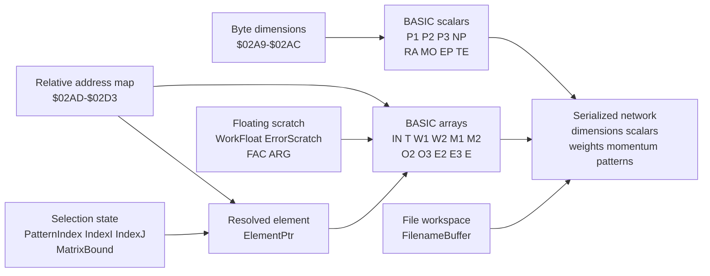
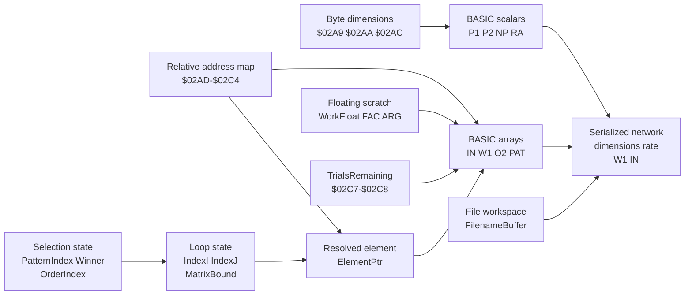

# BP.ML and CL.ML data structures

This document maps the data structures used by the reconstructed machine-language engines. It separates four storage domains that must not be confused:

1. BASIC-resident model data: five-byte numeric scalars and arrays owned by the caller.
2. Machine-language workspace: fixed C64 RAM cells used by the engine as counts, indices, offsets, pointers, flags, and scratch values.
3. Serialized network data: the byte stream written by the save entry point.
4. Embedded read-only data: DIM expressions, lookup strings, and floating constants stored inside the fixed-address payload.

The authoritative sources are the [BP.ML workspace equates](../combined/asm/BP.ML.s#L23), [BP.ML DIM expression](../combined/asm/BP.ML.s#L1893), [BP.ML save order](../combined/asm/BP.ML.s#L1539), [CL.ML workspace equates](../combined/asm/CL.ML.s#L23), [CL.ML DIM expression](../combined/asm/CL.ML.s#L1252), and [CL.ML save order](../combined/asm/CL.ML.s#L984).

## Common representation rules

- BASIC numeric scalars and array elements use Commodore BASIC's five-byte floating-point format.
- BASIC DIM bounds are inclusive. A vector declared as `V(N)` has `N+1` elements.
- For a matrix declared as `M(firstBound,secondBound)`, the first subscript changes fastest. Element `M(i,j)` begins `5 * (j * (firstBound + 1) + i)` bytes after `M(0,0)`.
- After `MakeOffsetsRelative`, every `...Offset` field is a 16-bit little-endian displacement. Scalar offsets are relative to `BASIC_VARTAB`; array offsets are relative to `BASIC_ARYTAB`. During initialization, those same slots temporarily hold absolute addresses returned by BASIC lookup routines and are converted before the public call returns.
- `ElementPtr`, `TotalErrorPtr`, and `EpsilonPtr` are 16-bit little-endian absolute addresses.
- Workspace fields are global and reused by non-reentrant routines. They are not a packed C structure and unnamed gaps are not engine-owned fields.
- `FAC` and `ARG` are BASIC ROM floating-point registers. They are transient system state, not persistent model storage.

## BP.ML data structures

### BASIC-resident backpropagation model

| Structure | Element type and logical shape | Meaning | Serialized |
| --- | --- | --- | --- |
| `P1`, `P2`, `P3`, `NP` | Four five-byte BASIC scalars, with byte copies in ML workspace | Input, hidden, output, and stored-pattern upper counts | Byte copies |
| `RA`, `MO`, `EP` | Five-byte BASIC scalars | Learning rate, momentum factor, and stopping tolerance | Yes |
| `TE` | Five-byte BASIC scalar | Total pre-update error for the most recent epoch | No |
| `IN(P1,NP)` | `(P1+1) * (NP+1)` five-byte elements | Binary input patterns; row zero is bias and column zero is recognition scratch | Yes |
| `T(P3,NP)` | `(P3+1) * (NP+1)` five-byte elements | Supervised target vectors | Yes |
| `W1(P2,P1)` | `(P2+1) * (P1+1)` five-byte elements | Input-to-hidden weights; input zero is the hidden bias weight | Yes |
| `M1(P2,P1)` | Same shape as `W1` | Previous `W1` changes used by momentum | Yes |
| `O2(P2)` | `P2+1` five-byte elements | Hidden activations; `O2(0)=1` is the output-layer bias input | No |
| `E2(P2)` | `P2+1` five-byte elements | Hidden deltas | No |
| `W2(P3,P2)` | `(P3+1) * (P2+1)` five-byte elements | Hidden-to-output weights; hidden zero is the output bias weight | Yes |
| `M2(P3,P2)` | Same shape as `W2` | Previous `W2` changes used by momentum | Yes |
| `O3(P3)` | `P3+1` five-byte elements | Output activations; index zero is initialized but not consumed by another layer | No |
| `E3(P3)` | `P3+1` five-byte elements | Output deltas | No |
| `E(NP)` | `NP+1` five-byte elements | Per-pattern half squared error; index zero is scratch | No |

### BP.ML machine-language workspace

| Address | Symbol | Size and representation | Meaning |
| --- | --- | --- | --- |
| `$02A7-$02A8` | `SavedTextPtr` | 2-byte absolute pointer | Saved BASIC parser position while embedded variable names are parsed |
| `$02A9` | `InputCount` | 1-byte unsigned count | Byte copy of `P1` |
| `$02AA` | `HiddenCount` | 1-byte unsigned count | Byte copy of `P2` |
| `$02AB` | `OutputCount` | 1-byte unsigned count | Byte copy of `P3` |
| `$02AC` | `PatternCount` | 1-byte unsigned count | Byte copy of `NP` |
| `$02AD-$02AE` | `RateOffset` | 16-bit VARTAB-relative offset | Locates scalar `RA` |
| `$02AF-$02B0` | `EpsilonOffset` | 16-bit VARTAB-relative offset | Locates scalar `EP` |
| `$02B1-$02B2` | `MomentumOffset` | 16-bit VARTAB-relative offset | Locates scalar `MO` |
| `$02B3-$02B4` | `O2Offset` | 16-bit ARYTAB-relative offset | Locates `O2(0)` |
| `$02B5-$02B6` | `O3Offset` | 16-bit ARYTAB-relative offset | Locates `O3(0)` |
| `$02B7-$02B8` | `E2Offset` | 16-bit ARYTAB-relative offset | Locates `E2(0)` |
| `$02B9-$02BA` | `E3Offset` | 16-bit ARYTAB-relative offset | Locates `E3(0)` |
| `$02BB` | `PatternIndex` | 1-byte unsigned index | Selected pattern; zero selects recognition scratch |
| `$02BF-$02C0` | `W1Offset` | 16-bit ARYTAB-relative offset | Locates `W1(0,0)` |
| `$02C1-$02C2` | `W2Offset` | 16-bit ARYTAB-relative offset | Locates `W2(0,0)` |
| `$02C3-$02C4` | `M1Offset` | 16-bit ARYTAB-relative offset | Locates `M1(0,0)` |
| `$02C5-$02C6` | `M2Offset` | 16-bit ARYTAB-relative offset | Locates `M2(0,0)` |
| `$02C7-$02C8` | `TeacherOffset` | 16-bit ARYTAB-relative offset | Locates `T(0,0)` |
| `$02C9-$02CA` | `InputOffset` | 16-bit ARYTAB-relative offset | Locates `IN(0,0)` |
| `$02CB-$02CC` | `ErrorOffset` | 16-bit ARYTAB-relative offset | Locates `E(0)` |
| `$02CD-$02D1` | `WorkFloat` | 5-byte BASIC float with a 2-byte overlay | Floating accumulator scratch; bytes zero and one are also reused as temporary pointer/count storage |
| `$02D2-$02D3` | `TotalErrorOffset` | 16-bit VARTAB-relative offset | Locates scalar `TE` |
| `$02D4-$02D5` | `TotalErrorPtr` | 16-bit absolute pointer | Resolved `TE` address during training |
| `$02D6-$02D7` | `EpsilonPtr` | 16-bit absolute pointer | Resolved `EP` address during tolerance checks |
| `$02D8-$02DC` | `ErrorScratch` | 5-byte BASIC float | Holds teacher minus output before squaring |
| `$02DD-$02F2` | `FilenameBuffer` | 22 bytes | Up to 20 filename bytes followed by `,R` or `,W` |
| `$0334-$0335` | `ElementPtr` | 16-bit absolute pointer | Address of the selected five-byte BASIC array element |
| `$0336` | `IndexI` | 1-byte unsigned index | Outer array, neuron, pattern, or I/O loop index |
| `$0338` | `IndexJ` | 1-byte unsigned index | Inner array or neuron loop index |
| `$03FC` | `ShowError` | 1-byte Boolean flag | Nonzero prints `TE` after each epoch |
| `$03FD` | `MatrixBound` | 1-byte unsigned bound | Saved first dimension upper bound used by `IndexMatrix` |

`$02BC-$02BE`, `$0337`, and `$0339` are not named or accessed as BP.ML fields. They are gaps between active workspace cells.

### BP.ML serialized network layout

The save file has no magic value, version, length field, or checksum. Fields are concatenated in this exact order:

| Relative position | Stored data | Size |
| --- | --- | --- |
| 0 | `P1` byte | 1 |
| 1 | `P2` byte | 1 |
| 2 | `P3` byte | 1 |
| 3 | `NP` byte | 1 |
| 4 | `RA` | 5 |
| 9 | `MO` | 5 |
| 14 | `EP` | 5 |
| 19 | `W1` including row and column zero | `5*(P2+1)*(P1+1)` |
| next | `W2` including row and column zero | `5*(P3+1)*(P2+1)` |
| next | `M1` including row and column zero | `5*(P2+1)*(P1+1)` |
| next | `M2` including row and column zero | `5*(P3+1)*(P2+1)` |
| next | `IN` including row and column zero | `5*(P1+1)*(NP+1)` |
| next | `T` including row and column zero | `5*(P3+1)*(NP+1)` |

Total bytes: `19 + 10*(P2+1)*(P1+1) + 10*(P3+1)*(P2+1) + 5*(P1+1)*(NP+1) + 5*(P3+1)*(NP+1)`.

### BP.ML embedded read-only data

| Payload address | Label | Contents |
| --- | --- | --- |
| `$CF2E-$CF8A` | `DimExpressions` | Null-terminated DIM text for all eleven arrays |
| `$CF8B-$CF9F` | `NameRate` through `NameNP` | Null-terminated scalar lookup names |
| `$CFA0-$CFA5` | `NameO1Unused` | Preserved unused `O1(0)` lookup text |
| `$CFA6-$CFF1` | `NameO2` through `NameError` | Null-terminated array lookup expressions |
| `$CFF2-$CFF6` | `FloatZero` | Five-byte floating zero |
| `$CFF7-$CFFB` | `FloatOne` | Five-byte floating one |
| `$CFFC-$CFFE` | `NameTotalError` | Null-terminated `TE` lookup name |

### BP.ML data model

## CL.ML data structures

### BASIC-resident competitive-learning model

| Structure | Element type and logical shape | Meaning | Serialized |
| --- | --- | --- | --- |
| `P1`, `P2`, `NP` | Three five-byte BASIC scalars, with byte copies in ML workspace | Input, cluster, and stored-pattern counts | Byte copies |
| `RA` | Five-byte BASIC scalar | Competitive-learning rate | Yes |
| `IN(P1,NP)` | `(P1+1) * (NP+1)` five-byte elements | Binary patterns; row zero stores active counts and column zero is recognition scratch | Yes |
| `W1(P2,P1)` | `(P2+1) * (P1+1)` five-byte elements | Normalized cluster prototypes; `W1(0,0)` is initialization sum scratch | Yes |
| `O2(P2)` | `P2+1` five-byte elements | Temporary activations, then one-hot winner output | No |
| `PAT(NP)` | `NP+1` five-byte elements | In-place shuffled training presentation order | No |

### CL.ML machine-language workspace

| Address | Symbol | Size and representation | Meaning |
| --- | --- | --- | --- |
| `$02A7-$02A8` | `SavedTextPtr` | 2-byte absolute pointer | Saved BASIC parser position while embedded variable names are parsed |
| `$02A9` | `InputCount` | 1-byte unsigned count | Byte copy of `P1` |
| `$02AA` | `OutputCount` | 1-byte unsigned count | Byte copy of cluster count `P2` |
| `$02AC` | `PatternCount` | 1-byte unsigned count | Byte copy of `NP` |
| `$02AD-$02AE` | `RateOffset` | 16-bit VARTAB-relative offset | Locates scalar `RA` |
| `$02B3-$02B4` | `O2Offset` | 16-bit ARYTAB-relative offset | Locates `O2(0)` |
| `$02BB` | `PatternIndex` | 1-byte unsigned index | Selected pattern; zero selects recognition scratch |
| `$02BF-$02C0` | `W1Offset` | 16-bit ARYTAB-relative offset | Locates `W1(0,0)` |
| `$02C1-$02C2` | `InputOffset` | 16-bit ARYTAB-relative offset | Locates `IN(0,0)` |
| `$02C3-$02C4` | `OrderOffset` | 16-bit ARYTAB-relative offset | Locates `PAT(0)` |
| `$02C5` | `Winner` | 1-byte unsigned index | Current winning cluster number |
| `$02C6` | `OrderIndex` | 1-byte unsigned index | Current position in shuffled `PAT` |
| `$02C7-$02C8` | `TrialsRemaining` | 16-bit little-endian counter | Requested learning passes; preserved decrement logic runs counts above 255 with a nonzero low byte 256 passes short |
| `$02CD-$02D1` | `WorkFloat` | 5-byte BASIC float with a 2-byte overlay | Dot-product, comparison, normalization, and update scratch; bytes zero and one are also temporary pointer storage |
| `$02DD-$02F2` | `FilenameBuffer` | 22 bytes | Up to 20 filename bytes followed by `,R` or `,W` |
| `$0334-$0335` | `ElementPtr` | 16-bit absolute pointer | Address of the selected five-byte BASIC array element |
| `$0336` | `IndexI` | 1-byte unsigned index | Outer cluster, pattern, input, or I/O loop index |
| `$0338` | `IndexJ` | 1-byte unsigned index | Inner array or input loop index |
| `$03FD` | `MatrixBound` | 1-byte unsigned bound | Saved first dimension upper bound used by `IndexMatrix` |

Addresses omitted from this table are not named or accessed as CL.ML workspace fields. In particular, `$02AB`, `$02AF-$02B2`, `$02B5-$02BA`, `$02BC-$02BE`, `$02C9-$02CC`, `$0337`, and `$0339` are gaps between active cells.

### CL.ML serialized network layout

The save file has no magic value, version, length field, or checksum.

| Relative position | Stored data | Size |
| --- | --- | --- |
| 0 | `P1` byte | 1 |
| 1 | `P2` byte | 1 |
| 2 | `NP` byte | 1 |
| 3 | `RA` | 5 |
| 8 | `W1` including row and column zero | `5*(P2+1)*(P1+1)` |
| next | `IN` including row and column zero | `5*(P1+1)*(NP+1)` |

Total bytes: `8 + 5*(P2+1)*(P1+1) + 5*(P1+1)*(NP+1)`.

`O2` and `PAT` are regenerated runtime state and are not serialized.

### CL.ML embedded read-only data

| Payload address | Label | Contents |
| --- | --- | --- |
| `$C935-$C957` | `DimExpressions` | Null-terminated DIM text for `O2`, `W1`, `IN`, and `PAT` |
| `$C958-$C963` | `NameRate` through `NameNP` | Null-terminated scalar lookup names |
| `$C964-$C980` | `NameO2` through `NameOrder` | Null-terminated array lookup expressions |
| `$C981-$C985` | `FloatZeroUnused` | Preserved five-byte zero with no internal load reference |
| `$C986-$C98A` | `FloatOneUnused` | Preserved five-byte one with no internal load reference |
| `$C98B-$C98D` | `NameTotalErrorUnused` | Preserved unused `TE` lookup name |

### CL.ML data model

## Shared C64 structures borrowed by both engines

| Address | Structure | Use |
| --- | --- | --- |
| `$0022-$0023` | `BASIC_INDEX` | Indirect byte pointer for serialization and string access |
| `$002D-$002E` | `BASIC_VARTAB` | Base for scalar-relative offsets |
| `$002F-$0030` | `BASIC_ARYTAB` | Base for array-relative offsets |
| `$0031-$0032` | `BASIC_STREND` | End of BASIC array storage |
| `$0033-$0034` | `BASIC_FRETOP` | Bottom of string storage during array allocation checks |
| `$0037-$0038` | `BASIC_MEMSIZ` | BASIC memory ceiling during allocation checks |
| `$007A-$007B` | `BASIC_TXTPTR` | Parser pointer redirected to embedded names and DIM expressions |
| `$0100` onward | `BASIC_PRINT_BUFFER` | ASCII result buffer used when BP.ML prints total error |
