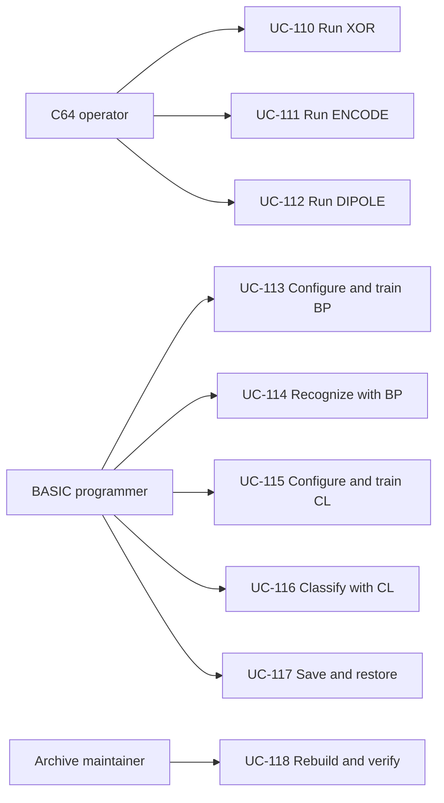

# Reverse-Engineered Use Cases

Generated 2026-09-16T16:03:42.304Z from the live MCP use-case store. Product key: `prod-c64-neural-networks`.

These use cases describe the behavior preserved in `combined/`. They remain Draft because full execution on a C64 emulator or physical C64 has not yet been completed.

## UC-110: Run the XOR demonstration

- Approval: Draft
- Priority: 90
- Scope: Combined C64 neural-network archive
- Precondition: A compatible C64 or emulator is available and Neural-Networks-C64.d64 is mounted as device 8.
- Postcondition: The four XOR inputs and their rounded O3 decisions are displayed, or the operator has interrupted learning at an epoch boundary.
- Realizes: `FR-NN-012`, `FR-NN-001`, `FR-NN-004`, `FR-NN-005`

Actor: C64 operator. Main flow: mount the combined D64 as device 8; load and run XOR; let the program identify or load BP.ML; initialize the 2-2-1 network; define four truth-table pairs; learn until tolerance; print all four classifications. Alternative: RUN/STOP exits through BASIC break handling after the current epoch.

## UC-111: Run the ENCODE demonstration

- Approval: Draft
- Priority: 90
- Scope: Combined C64 neural-network archive
- Precondition: A compatible C64 or emulator is available and Neural-Networks-C64.d64 is mounted as device 8.
- Postcondition: Hidden O2 codes and rounded O3 outputs for all four encoder patterns are displayed, or learning was interrupted cleanly.
- Realizes: `FR-NN-012`, `FR-NN-001`, `FR-NN-004`, `FR-NN-005`

Actor: C64 operator. Main flow: mount the combined D64; load and run ENCODE; let the program identify or load BP.ML; initialize a 4-2-4 network; define four one-hot pairs; learn until tolerance; print the hidden two-bit code and rounded four-bit output for each input. Alternative: RUN/STOP exits after the current epoch.

## UC-112: Run the DIPOLE demonstration

- Approval: Draft
- Priority: 90
- Scope: Combined C64 neural-network archive
- Precondition: A compatible C64 or emulator is available and Neural-Networks-C64.d64 is mounted as device 8.
- Postcondition: Two learned cluster-weight rows are displayed after 400 one-pass epochs, or the operator has interrupted training.
- Realizes: `FR-NN-012`, `FR-NN-001`, `FR-NN-008`, `FR-NN-009`, `FR-NN-010`

Actor: C64 operator. Main flow: mount the combined D64; load and run DIPOLE; let the program identify or load CL.ML; initialize a 16-input, two-cluster network; define 24 horizontal and vertical dipoles; execute 400 one-pass learning calls; inspect both learned weight rows. Alternative: RUN/STOP interrupts the active pass.

## UC-113: Configure and train a BP network

- Approval: Draft
- Priority: 80
- Scope: Combined C64 neural-network archive
- Precondition: BP.ML is loaded and sufficient BASIC memory is available for the requested dimensions.
- Postcondition: W1 and W2 contain trained weights and TE is at or below EP unless the operator interrupted training.
- Realizes: `FR-NN-002`, `FR-NN-003`, `FR-NN-004`

Actor: BASIC programmer. Main flow: load BP.ML at $C000; call SYS 49152 with dimensions and learning parameters; define each supervised pair through SYS 49167; call SYS 49164 to learn until TE is no greater than EP; optionally observe TE. Alternative: RUN/STOP ends learning after the current epoch; invalid indices or lengths raise BASIC illegal quantity.

## UC-114: Recognize a pattern with BP

- Approval: Draft
- Priority: 80
- Scope: Combined C64 neural-network archive
- Precondition: A BP network with dimensions and weights is initialized or restored.
- Postcondition: O2 and O3 contain the forward-pass activations for scratch pattern zero.
- Realizes: `FR-NN-005`

Actor: BASIC programmer. Main flow: initialize or restore a BP network; call SYS 49155 with a P1-character pattern; read O2 for hidden activations and O3 for final activations. Alternative: a wrong-length string raises BASIC illegal quantity.

## UC-115: Configure and train a CL network

- Approval: Draft
- Priority: 80
- Scope: Combined C64 neural-network archive
- Precondition: CL.ML is loaded and sufficient BASIC memory is available for the requested dimensions.
- Postcondition: Winning clusters have moved toward normalized training patterns for the completed passes.
- Realizes: `FR-NN-007`, `FR-NN-008`, `FR-NN-009`

Actor: BASIC programmer. Main flow: load CL.ML at $C000; call SYS 49152 with P1, P2, NP, and RA; define each pattern through SYS 49167; call SYS 49164 for learning passes. For exact counts above 255, issue repeated one-pass calls. Alternative: RUN/STOP interrupts the active pass; wrong indices or lengths raise BASIC illegal quantity.

## UC-116: Classify a pattern with CL

- Approval: Draft
- Priority: 80
- Scope: Combined C64 neural-network archive
- Precondition: A CL network with dimensions and cluster weights is initialized or restored.
- Postcondition: O2 contains one for the winning cluster and zero for all losing clusters.
- Realizes: `FR-NN-010`

Actor: BASIC programmer. Main flow: initialize or restore a CL network; call SYS 49155 with a P1-character pattern; inspect O2 to find the one-hot winning cluster. Alternative: a wrong-length string raises BASIC illegal quantity.

## UC-117: Save and restore network state

- Approval: Draft
- Priority: 70
- Scope: Combined C64 neural-network archive
- Precondition: The matching engine is loaded and device 8 is available for sequential file I/O.
- Postcondition: The engine has recreated BASIC storage and restored the serialized state for the selected network family.
- Realizes: `FR-NN-006`, `FR-NN-011`

Actor: BASIC programmer. Main flow: initialize or train BP.ML or CL.ML; call SYS 49170 with a filename to write a sequential device-8 file; later load the matching engine and call SYS 49173 with the filename; continue recognition or training. Alternative: a drive error is printed before channels are closed and BASIC returns to READY.

## UC-118: Rebuild and verify the combined archive

- Approval: Draft
- Priority: 100
- Scope: Combined C64 neural-network archive
- Precondition: PowerShell 7, cc65, VICE c1541, and petcat are available as required by the verification scripts.
- Postcondition: Verification receipts identify the exact hashes, counts, and any remaining full-runtime gap for the combined edition.
- Realizes: `FR-NN-013`

Actor: archive maintainer. Main flow: build BP.ML and CL.ML with target-neutral ca65; compare outputs byte for byte; run counter characterization; verify D64 extraction, BASIC structure and round trips, listing checks, source hashes, and the PDF; retain receipts and provenance. Alternative: any mismatch blocks acceptance and is investigated against the selected source collection.

## Actor relationship view

